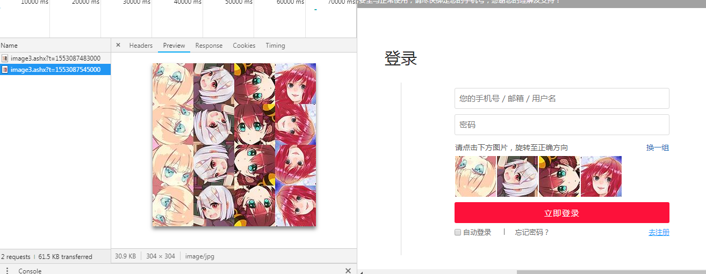
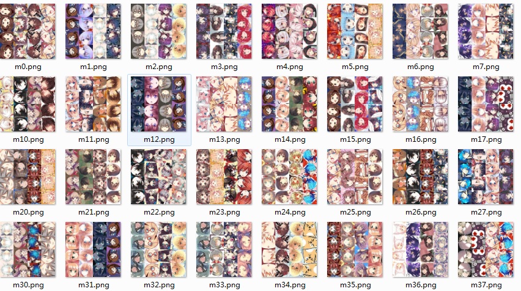
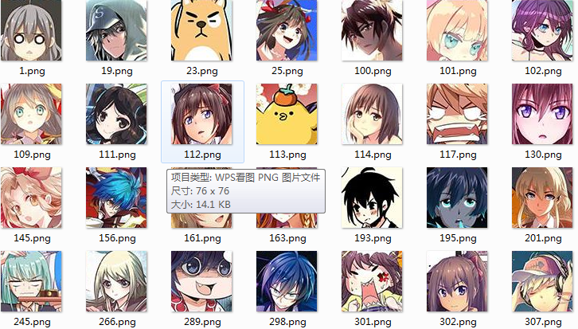
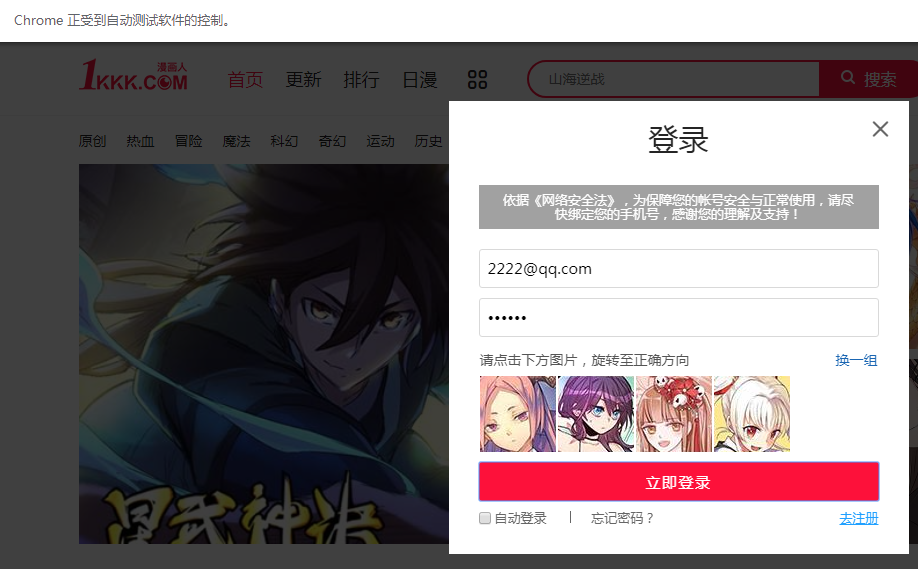

# 1kkk破解图形旋转验证码

**1kkk漫画登陆界面**


**设计一个方法让图片自动旋转到位**

----

**通过观察发现这四张图片是从一张大图中随机切取一行形成的**




## 破解思路

* 收集尽可能多的人物头像
* 对头像进行去重
* 人工矫正头像得到头像库
* 使用selenium进行登录，每一个头像点击旋转4次与头像库的图片进行对比，对比成功则直接旋转下一个头像


**1.获取大图**

新建get_bigp.py文件,获取300张大图

```
import requests
import time
headers = {
	"User-Agent": "Mozilla/5.0 (Windows NT 6.3; WOW64) AppleWebKit/537.36 (KHTML, likeGecko) 	  Chrome/52.0.2743.116 Safari/537.36",}

def get_pic():
	for i in range(300):
		time = 1553563120000+i
		url = 'http://www.1kkk.com/image3.ashx?t='+str(time)+'&quot'
		res = requests.get(url,headers=headers)
		print(res.status_code)
		content = res.content
		name = 'm'+str(i)
		with open('./kkk_images/%s.png' % name,'wb') as f:
			f.write(content)
			print(i)

get_pic()
```




**2.获取所有人物头像小图**

每张大图每个人物重复了四次，这里只取最上面的一行

新建一个文件crop4.py, 这里需要用到Image库处理图片

```
from PIL import Image
from io import BytesIO
import os

def crop4():
	"""获取每一个头像"""
	lists = os.listdir('./kkk_images') # 获取目录下所有文件
	m = 0
	for li in lists:
		screenshot = Image.open('%s/%s' % ('./kkk_images', li))
		crop_image = screenshot.crop((0, 0, 304, 76))
		for i in range(0,4):
			# 每个小图头像宽高都是76个像素
			crop_image = screenshot.crop((i*76, 0, (i+1)*76, 76))
			file_name = './small_pic1/'+'m'+str(m)+'.png'
			crop_image.save(file_name)
			m = m +1

if __name__ == "__main__":
	crop4()
```


**3.图像初步去重**

这里每一个头像旋转四次与后面每张头像进行逐一像素对比

新建2个文件

* Dup.py文件用来实现操作图片进行比较和删除图片
* compare_helper.py文件用来对比两张图片的相似度,返回一个数值，100表示相似度最高

```
# compare_helper.py
from PIL import Image,ImageEnhance,ImageFilter
import os
import fnmatch
import re,time 
import urllib, random
 
def getGray(image_file):
   tmpls=[]
   for h in range(0,  image_file.size[1]):#h
      for w in range(0, image_file.size[0]):#w
         tmpls.append( image_file.getpixel((w,h))  )
          
   return tmpls
 
def getAvg(ls):#获取平均灰度值
   return sum(ls)/len(ls)
 
def getMH(a,b):#比较100个字符有几个字符相同
   dist = 0;
   for i in range(0,len(a)):
      if a[i]==b[i]:
         dist=dist+1
   return dist


def getImgHash(fne):
   image_file = Image.open(fne) # 打开
   image_file=image_file.resize((12, 12))#重置图片大小我12px X 12px
   image_file=image_file.convert("L")#转256灰度图
   Grayls=getGray(image_file)#灰度集合
   avg=getAvg(Grayls)#灰度平均值
   bitls=''#接收获取0或1
   #除去变宽1px遍历像素
   for h in range(1,  image_file.size[1]-1):#h
      for w in range(1, image_file.size[0]-1):#w
         if image_file.getpixel((w,h))>=avg:#像素的值比较平均值 大于记为1 小于记为0
            bitls=bitls+'1'
         else:
            bitls=bitls+'0'
   return bitls


def get_compare(obj, obj2):
   a=getImgHash(obj)#图片地址自行替换
   b=getImgHash(obj2)
   compare=getMH(a,b)
   return compare


if __name__ == '__main__':
   filename1 = './same/1537167265503_3.jpeg'
   filename2 = './same/1537167265721_2.jpeg'
   compare = get_compare(filename1, filename2)
   print(compare)

```

```
# Dup.py
from PIL import Image
from io import BytesIO
import os
from compare_helper import get_compare
list_remove = set() #添加相似的图片地址
def Dupli():
	"""去重"""

	rotate = 90 #每次旋转90度
	lists = os.listdir('./small_pic1')
	# print(lists)
	lenth = len(lists)-1
	for i in range(lenth-1):
		for n in range(4):
			# 每旋转1次与后面的对比
			img_url ='./small_pic1' + '/'+lists[i]
			img1 = Image.open(img_url)
			out = img1.rotate(rotate)
			out.save(img_url)
			k = i+1
			for j in range(k,lenth):
				src1 = './small_pic1' + '/' + lists[i]
				src2 = './small_pic1' + '/' + lists[j]
				if src2 in list_remove:
					continue
				score = get_compare(src1,src2)
				print('i=%s , j=%s , score=%s' %(lists[i],lists[j],score))

				# 相似度90以上删除
				if score>90:
					list_remove.add(src2)

def rem():
	for remove_pic in list_remove:
		os.remove(remove_pic) #删除文件
	print('shanchu chenggong!!!!!!!!!!!!!')

if __name__ == "__main__":
	Dupli()
	rem()


```


**4.对剩下的图片进行手动纠正,使头像为正向的**



**5.使用selenium进行登录**

* 先注册一个账号
* 点击登录页面中的图片（最多点4四次），与图片库中的图片依次对比

新建kkk1_selenium.py文件

```
from selenium import webdriver
from selenium.common.exceptions import TimeoutException
from selenium.webdriver.common.by import By
from selenium.webdriver.support.ui import WebDriverWait
from selenium.webdriver.support import expected_conditions as EC
from urllib.parse import quote
from lxml import etree
from PIL import Image
from io import BytesIO
import requests
import os
import time,threading
from compare_helper import get_compare
import json


chrome_options = webdriver.ChromeOptions()
browser = webdriver.Chrome(chrome_options=chrome_options)

browser.set_window_size(1400, 700)
wait = WebDriverWait(browser, 5)

def get_big_image():
    # browser.execute_script('window.scrollTo(0, 300)')
    screenshot = browser.get_screenshot_as_png()
    screenshot = Image.open(BytesIO(screenshot))
    return screenshot

# 取验证码坐标位置（左上角和右下角）
def get_position():
	imgs = wait.until(EC.presence_of_all_elements_located((By.XPATH, '//div[@class="form-wrap"]//div[@class="rotate-background"]')))
	print(imgs)
	lists = []
    # 第一张图片验证码的坐标
	for img in imgs:

		x1 = img.location['x']
		y1 = img.location['y']
		x2 = img.size['width']
		y2 = img.size['height']	
		lists.append((x1,y1,x1+x2,y1+y2))
		print(x1,y1,x1+x2,y1+y2)	
	return lists

def get_page():
	#点击弹出登陆框
	submit = wait.until(
	EC.element_to_be_clickable((By.CSS_SELECTOR, '.header-avatar'))
	)

	submit.click()
	i = 1
	time.sleep(2) #等待登录框出现
	screenshot = get_big_image()
	screenshot.save('full_screen.png')
	list_all = get_position()
	img_obj = []
	for li in list_all:
		crop_image = screenshot.crop(li)
		img_url = './'+'m'+str(i)+'.png'
		crop_image.save(img_url)
		i += 1
		img_obj.append(img_url)
		# img_obj.append(crop_image)

	#准备进入输入操作

	input = wait.until(
		EC.presence_of_element_located((By.CSS_SELECTOR, 'input[name="txt_name"]')))
	input.clear()
	input.send_keys(user)

	input = wait.until(
	EC.presence_of_element_located((By.CSS_SELECTOR, 'input[name="txt_password"]')))
	input.clear()
	input.send_keys(pw)
	
	#确定点击事件
	submit = wait.until(
	EC.presence_of_element_located((By.CSS_SELECTOR, 'button[id="btnLogin"]')))

	# 换一组图片
	reset = wait.until(
	EC.presence_of_element_located((By.CSS_SELECTOR, 'a[class="rotate-refresh"')))

	
	lists = os.listdir('./small_pic1')
	lenth = len(lists)
	sucess = 0
	k=0
	rotate_backgrounds = wait.until(EC.presence_of_all_elements_located((By.XPATH, '//div[@class="form-wrap"]/div/div[@class="rotate-background"]')))
	# 旋转对比
	for img in rotate_backgrounds:
		print('into---------')
		for n in range(4):
			flag = False
			for li in lists:
				img_url = '%s/%s' % ('./small_pic1/', li)
				# 
				s = get_compare(img_obj[k], img_url)
				print(k, img_obj[k],img_url,s)
				if s>90:
					print(s)
					flag = True
					sucess += 1
					break
			if flag==True:
				break
			img.click()
			# 旋转后再在图片库中比较
			img1 = Image.open(img_obj[k])
			out = img1.rotate(-90)
			out.save(img_obj[k])
		k+=1

	if sucess==4:
		print('成功！')
		submit.click()
	else:
		print('失败')
		# reset.click()
		# get_page()

if __name__ == "__main__":

	url = 'http://www.1kkk.com'
	browser.get(url)
	print('网址获取成功！！！！！！！！！！！！！！')
	user = '2222@qq.com'
	pw = '123456'
	get_page()

```

# 效果



