# Spider-project
##爬虫项目

…… 

[TOC]

…… 

------------------

# 1kkk动漫网-破解图形旋转验证码

**<a id="1">1kkk漫画登陆界面</a>**


**设计一个方法让图片自动旋转到位**

----

**通过观察发现这四张图片是从一张大图中随机切取一行形
成的**


**破解思路**

* 收集尽可能多的人物头像
* 对头像进行去重
* 人工矫正头像得到头像库
* 使用selenium进行登录，每一个头像点击旋转4次与头像库
  的图片进行对比，对比成功则直接旋转下一个头像


**1.获取大图**

新建get_bigp.py文件,获取300张大图

```
import requests
import time
headers = {
	"User-Agent": "Mozilla/5.0 (Windows NT 6.3; 
WOW64) AppleWebKit/537.36 (KHTML, likeGecko) 	  
Chrome/52.0.2743.116 Safari/537.36",}

def get_pic():
	for i in range(300):
		time = 1553563120000+i
		url = 
'http://www.1kkk.com/image3.ashx?t='+str
(time)+'&quot'
		res = requests.get
(url,headers=headers)
		print(res.status_code)
		content = res.content
		name = 'm'+str(i)
		with open('./kkk_images/%s.png' % 
name,'wb') as f:
			f.write(content)
			print(i)

get_pic()
```


**2.获取所有人物头像小图**

每张大图每个人物重复了四次，这里只取最上面的一行

新建一个文件crop4.py, 这里需要用到Image库处理图片

```
from PIL import Image
from io import BytesIO
import os

def crop4():
	"""获取每一个头像"""
	lists = os.listdir('./kkk_images') # 获取目录
下所有文件
	m = 0
	for li in lists:
		screenshot = Image.open('%s/%s' % 
('./kkk_images', li))
		crop_image = screenshot.crop((0, 0, 
304, 76))
		for i in range(0,4):
			# 每个小图头像宽高都是76个像
素
			crop_image = screenshot.crop
((i*76, 0, (i+1)*76, 76))
			file_name = 
'./small_pic1/'+'m'+str(m)+'.png'
			crop_image.save(file_name)
			m = m +1

if __name__ == "__main__":
	crop4()
```


**3.图像初步去重**

这里每一个头像旋转四次与后面每张头像进行逐一像素对比

新建2个文件

* Dup.py文件用来实现操作图片进行比较和删除图片
* compare_helper.py文件用来对比两张图片的相似度,返回
  一个数值，100表示相似度最高

```
# compare_helper.py
from PIL import Image,ImageEnhance,ImageFilter
import os
import fnmatch
import re,time 
import urllib, random
 
def getGray(image_file):
   tmpls=[]
   for h in range(0,  image_file.size[1]):#h
      for w in range(0, image_file.size[0]):#w
         tmpls.append( image_file.getpixel((w,h))  )
          
   return tmpls
 
def getAvg(ls):#获取平均灰度值
   return sum(ls)/len(ls)
 
def getMH(a,b):#比较100个字符有几个字符相同
   dist = 0;
   for i in range(0,len(a)):
      if a[i]==b[i]:
         dist=dist+1
   return dist


def getImgHash(fne):
   image_file = Image.open(fne) # 打开
   image_file=image_file.resize((12, 12))#重置图片大
小我12px X 12px
   image_file=image_file.convert("L")#转256灰度图
   Grayls=getGray(image_file)#灰度集合
   avg=getAvg(Grayls)#灰度平均值
   bitls=''#接收获取0或1
   #除去变宽1px遍历像素
   for h in range(1,  image_file.size[1]-1):#h
      for w in range(1, image_file.size[0]-1):#w
         if image_file.getpixel((w,h))>=avg:#像素的值
比较平均值 大于记为1 小于记为0
            bitls=bitls+'1'
         else:
            bitls=bitls+'0'
   return bitls


def get_compare(obj, obj2):
   a=getImgHash(obj)#图片地址自行替换
   b=getImgHash(obj2)
   compare=getMH(a,b)
   return compare


if __name__ == '__main__':
   filename1 = './same/1537167265503_3.jpeg'
   filename2 = './same/1537167265721_2.jpeg'
   compare = get_compare(filename1, filename2)
   print(compare)

```

```
# Dup.py
from PIL import Image
from io import BytesIO
import os
from compare_helper import get_compare
list_remove = set() #添加相似的图片地址
def Dupli():
	"""去重"""

	rotate = 90 #每次旋转90度
	lists = os.listdir('./small_pic1')
	# print(lists)
	lenth = len(lists)-1
	for i in range(lenth-1):
		for n in range(4):
			# 每旋转1次与后面的对比
			img_url ='./small_pic1' + 
'/'+lists[i]
			img1 = Image.open(img_url)
			out = img1.rotate(rotate)
			out.save(img_url)
			k = i+1
			for j in range(k,lenth):
				src1 = './small_pic1' 
+ '/' + lists[i]
				src2 = './small_pic1' 
+ '/' + lists[j]
				if src2 in 
list_remove:
					continue
				score = get_compare
(src1,src2)
				print('i=%s , j=%s , 
score=%s' %(lists[i],lists[j],score))

				# 相似度90以上删除
				if score>90:
					
list_remove.add(src2)

def rem():
	for remove_pic in list_remove:
		os.remove(remove_pic) #删除文件
	print('shanchu chenggong!!!!!!!!!!!!!')

if __name__ == "__main__":
	Dupli()
	rem()


```


**4.对剩下的图片进行手动纠正,使头像为正向的**


**5.使用selenium进行登录**

* 先注册一个账号
* 点击登录页面中的图片（最多点4四次），与图片库中的图
  片依次对比

新建kkk1_selenium.py文件

```
from selenium import webdriver
from selenium.common.exceptions import 
TimeoutException
from selenium.webdriver.common.by import By
from selenium.webdriver.support.ui import 
WebDriverWait
from selenium.webdriver.support import 
expected_conditions as EC
from urllib.parse import quote
from lxml import etree
from PIL import Image
from io import BytesIO
import requests
import os
import time,threading
from compare_helper import get_compare
import json


chrome_options = webdriver.ChromeOptions()
browser = webdriver.Chrome
(chrome_options=chrome_options)

browser.set_window_size(1400, 700)
wait = WebDriverWait(browser, 5)

def get_big_image():
    # browser.execute_script('window.scrollTo(0, 
300)')
    screenshot = browser.get_screenshot_as_png()
    screenshot = Image.open(BytesIO(screenshot))
    return screenshot

# 取验证码坐标位置（左上角和右下角）
def get_position():
	imgs = wait.until
(EC.presence_of_all_elements_located((By.XPATH, 
'//div[@class="form-wrap"]//div[@class="rotate-
background"]')))
	print(imgs)
	lists = []
    # 第一张图片验证码的坐标
	for img in imgs:

		x1 = img.location['x']
		y1 = img.location['y']
		x2 = img.size['width']
		y2 = img.size['height']	
		lists.append((x1,y1,x1+x2,y1+y2))
		print(x1,y1,x1+x2,y1+y2)	
	return lists

def get_page():
	#点击弹出登陆框
	submit = wait.until(
	EC.element_to_be_clickable((By.CSS_SELECTOR, 
'.header-avatar'))
	)

	submit.click()
	i = 1
	time.sleep(2) #等待登录框出现
	screenshot = get_big_image()
	screenshot.save('full_screen.png')
	list_all = get_position()
	img_obj = []
	for li in list_all:
		crop_image = screenshot.crop(li)
		img_url = './'+'m'+str(i)+'.png'
		crop_image.save(img_url)
		i += 1
		img_obj.append(img_url)
		# img_obj.append(crop_image)

	#准备进入输入操作

	input = wait.until(
		EC.presence_of_element_located
((By.CSS_SELECTOR, 'input[name="txt_name"]')))
	input.clear()
	input.send_keys(user)

	input = wait.until(
	EC.presence_of_element_located
((By.CSS_SELECTOR, 'input[name="txt_password"]')))
	input.clear()
	input.send_keys(pw)
	
	#确定点击事件
	submit = wait.until(
	EC.presence_of_element_located
((By.CSS_SELECTOR, 'button[id="btnLogin"]')))

	# 换一组图片
	reset = wait.until(
	EC.presence_of_element_located
((By.CSS_SELECTOR, 'a[class="rotate-refresh"')))

	
	lists = os.listdir('./small_pic1')
	lenth = len(lists)
	sucess = 0
	k=0
	rotate_backgrounds = wait.until
(EC.presence_of_all_elements_located((By.XPATH, 
'//div[@class="form-wrap"]/div/div[@class="rotate-
background"]')))
	# 旋转对比
	for img in rotate_backgrounds:
		print('into---------')
		for n in range(4):
			flag = False
			for li in lists:
				img_url = '%s/%s' % 
('./small_pic1/', li)
				# 
				s = get_compare
(img_obj[k], img_url)
				print(k, img_obj
[k],img_url,s)
				if s>90:
					print(s)
					flag = True
					sucess += 1
					break
			if flag==True:
				break
			img.click()
			# 旋转后再在图片库中比较
			img1 = Image.open(img_obj[k])
			out = img1.rotate(-90)
			out.save(img_obj[k])
		k+=1

	if sucess==4:
		print('成功！')
		submit.click()
	else:
		print('失败')
		# reset.click()
		# get_page()

if __name__ == "__main__":

	url = 'http://www.1kkk.com'
	browser.get(url)
	print('网址获取成功！！！！！！！！！！！！！
！')
	user = '2222@qq.com'
	pw = '123456'
	get_page()

```

**效果**


------


# Scrapy分布式爬取安居客 --使用Scrapyd部署

**1.爬取安居客租房信息**


**2.通过https://www.anjuke.com/sy-city.html这页面获取所有地点**

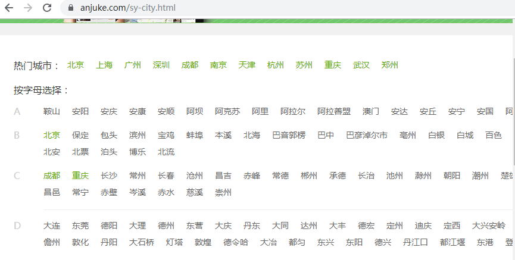

**3.新建scrapy工程并用Pycharm 打开**

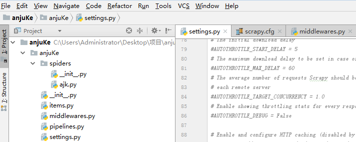

**4.编写item**

这里就简单的爬取下房屋地点、图片、价格、标题、描述

```
class AnjukeItem(Item):
    """创建名为anjuke的item"""
    table_name = 'anjuke'
    
    img_url = Field()
    title = Field()
    info = Field()
    addr = Field()
    price = Field()
```

**5.编写spider**

* 获取所有城市地点
* 选择每个地点的租房信息
* 获取每个地点所有的租房信息（通过获取下一页连接进行翻页）

```
class AjkSpider(scrapy.Spider):
    name = 'ajk'
    allowed_domains = ['*']
    citys_url = 'https://www.anjuke.com/sy-city.html'

    def start_requests(self):
        yield Request(self.citys_url, dont_filter=True, callback=self.parse)

    def parse(self, response):
        """解析每个地点"""
        
        # print(response.status,'-------------status')
        res = (response.text)
        html = etree.HTML(res)
        cons = html.xpath('//div[@class="letter_city"]/ul//li')
        
        # 获取每一个地点的链接
        for con in cons[:]:
            citys = con.xpath('.//div[@class="city_list"]//a')
            for every_city in citys[:]:
                href = every_city.xpath('./@href')
                city = every_city.xpath('./text()')
                if href:
                    yield Request(href[0], dont_filter=True, callback=self.parse_city)


    def parse_city(self, response):
        """获取租房的链接"""
        # print(response.status)
        res = ( response.text)
        html = etree.HTML(res)
        con = html.xpath('//li[@class="li_single li_itemsnew li_unselected"]//a[@class="a_navnew"]/@href')
        
        if con:
            yield Request(con[2], dont_filter=True, callback=self.parse_zu)

    def parse_zu(self, response):
        """解析租房信息"""
        
        print(response.status)
        res = response.text
        html = etree.HTML(res)
        # bs = BeautifulSoup(res, 'lxml')
        # b4 = bs.title.string
        # print(b4)
        cons = html.xpath('//div[@class="zu-itemmod  "]')
        next = html.xpath('//a[@class="aNxt"]/@href') # 下一页链接
        
        # 依次获取每个租房信息
        for con in cons[:]:
            print('into------------')
            img_url = con.xpath('./a/img/@src')
            title = con.xpath('./div[@class="zu-info"]/h3/a/text()')
            info = con.xpath('./div[@class="zu-info"]/p//text()')
            addr = con.xpath('./div[@class="zu-info"]/address[@class="details-item"]//text()')
            price = con.xpath('./div[@class="zu-side"]/p/strong/text()')

            item = AnjukeItem()
            item['img_url'] = img_url[0] if img_url else ''
            item['title'] = title[0] if title else ''
            item['info'] = info[0] if info else ''
            item['price'] = price[0] if price else ''
            item['addr'] = addr
            yield item

        if next:
            yield Request(next[0], dont_filter=True, callback=self.parse_zu)

```

**6.pineline编写**

* 由于地址信息返回是一个列表其中有一些格式问题，需要去掉空格换行，最后用join方法拼成字符串
* 这里用mongodb保存数据并通过update去重，在setting配置相关信息，用from_crawler函数导入配置信息

```
class AnjukePipeline(object):
    def __init__(self, mongo_uri, mongo_db):
        self.mongo_uri = mongo_uri
        self.mongo_db = mongo_db

    @classmethod
    def from_crawler(cls, crawler):
        return cls(
            mongo_uri=crawler.settings.get('MONGO_URI'),
            mongo_db=crawler.settings.get('MONGO_DATABASE')
        )

    def open_spider(self, spider):
        self.client = pymongo.MongoClient(self.mongo_uri)
        self.db = self.client[self.mongo_db]

    def close_spider(self, spider):
        self.client.close()

    def process_item(self, item, spider):
        s = item['addr']
        l = []
        # addr存在则进行清洗
        if s:
            for i in s[:]:
                l.append(i.strip())
        item['addr'] = ','.join(l)
        self.db[item.table_name].update({'title': item.get('title')}, {'$set': dict(item)}, True)
        return item
```

**7.middlewares配置**

笔者付费买了蘑菇代理并在腾讯云搭了个代理池，代理池是参考网上大神的编写的，笔者将获取免费代理ip那部分函数注释了，换成调用蘑菇代理。当然是用免费的代理还是可以用的如需要可参考：

```
def get_ip():
	"""代理获取接口"""
    s = requests.get('http://129.28.109.42:5000/random')
    ip = 'http://' + s.text
    return ip

class ProxyMiddleware(object):
    def process_request(self, request, spider):
        request.meta['proxies'] = get_ip()
```


**7.setting配置**

* robots、User-Agent 必须配置,否则会失败
* 开启所有用到的中间件
* 分布式的配置（需安装scrapy-redis，这里笔者用阿里云搭建redis服务器）

```
"""分布式的一些配置"""
SCHEDULER = "scrapy_redis.scheduler.Scheduler" # 配置调度队列

DUPEFILTER_CLASS = "scrapy_redis.dupefilter.RFPDupeFilter" # 指定使用scrapy_redis提供的去重类

SCHEDULER_FLUSH_ON_START = True #爬取完后不清空爬取队列和去重指纹

REDIS_URL = 'redis://47.106.211.81:6379' # redis地址
```


**8.scrapyd部署**

实现分布式可使用git或压缩后传到服务器，这里讲讲另一种方法

笔者使用腾讯云和百度云部署scrapyd

centos安装scrapy和scrapyd

```
sudo yum groupinstall development tools
sudo yum install python34-devel epel-release libxslt-devel libxml2-devel openssldevel
# 前提python3已经安好
pip3 install Scrapy
pip3 install Scrapyd

# 安装scrapyd时遇到一个错误Failed to load application: No module named '_sqlite3'
yum install sqlite*
# 然后重新编译python或者重新安装python
./configure --prefix=/usr/local/python3
make && make install
```

ubuntu安装scrapy和scrapyd

```
# 环境安装
sudo apt-get install build-essential python3-dev libssl-dev libffi-dev libxml2
libxml2-dev libxslt1-dev zlib1g-dev
# 安装升级pip3
sudo apt-get install python3-pip
sudo pip3 install --upgrade pip
# 修改/usr/bin/文件夹下的pip3文件，输入sudo vi /usr/bin/pip3命令，替换成下面内容
from pip import __main__
if __name__ == '__main__':
    sys.exit(__main__._main())
#
pip3 install Scrapy
pip3 install Scrapyd

```

**设置配置文件并启动scrapyd**

```
# 在/etc/scrapyd/scrapyd.conf写入内容
# 写入
[scrapyd]
eggs_dir    = eggs
logs_dir    = logs
items_dir   =
jobs_to_keep = 5
dbs_dir     = dbs
max_proc    = 0
max_proc_per_cpu = 4
finished_to_keep = 100
poll_interval = 5.0
bind_address = 0.0.0.0
http_port   = 6800
debug       = off
runner      = scrapyd.runner
application = scrapyd.app.application
launcher    = scrapyd.launcher.Launcher
webroot     = scrapyd.website.Root
 
[services]
schedule.json     = scrapyd.webservice.Schedule
cancel.json       = scrapyd.webservice.Cancel
addversion.json   = scrapyd.webservice.AddVersion
listprojects.json = scrapyd.webservice.ListProjects
listversions.json = scrapyd.webservice.ListVersions
listspiders.json  = scrapyd.webservice.ListSpiders
delproject.json   = scrapyd.webservice.DeleteProject
delversion.json   = scrapyd.webservice.DeleteVersion
listjobs.json     = scrapyd.webservice.ListJobs
daemonstatus.json = scrapyd.webservice.DaemonStatus
```

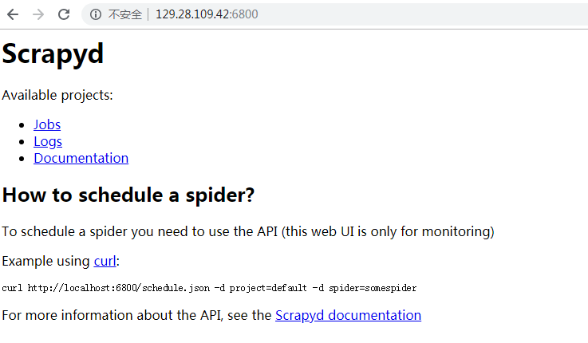

**8.安装scrapyd-client**

使用scrapyd-client上传文件到远程主机，这里笔者在自己的电脑安装

```
pip install scrapyd-client

# 如果是window还要写一个批处理文件
python目录的Scripts目录下创建scrapyd-deploy.bat文件
scrapyd-deploy.bat 文件中输入以下内容：
@echo off
D:\Python36\python.exe D:\Python36\Scripts\scrapyd-deploy %* #前面是python路径 后面是scrapyd-deploy路径，%*是用来跟参数的
```

**在scrapy-cfg中配置远程主机地址**

```
[settings]
default = anjuKe.settings

[deploy:vm1]  # vm1是主机别名用来区分不同主机
url = http://129.28.109.42:6800/
project = anjuKe

[deploy:vm2]
url = http://106.13.109.64:6800/
project = anjuKe
```


**运行**

```
scrapyd-deploy vm1 # 上传文件
curl http://129.28.109.42:6800/schedule.json -d project=anjuKe -d spider=ajk # 运行scrapy
# 成功会返回消息
Server response (200):
{"project": "anjuKe", "status": "ok", "spiders": 1, "version": "1553022223", "node_name": "instance-5538u54p"}

```

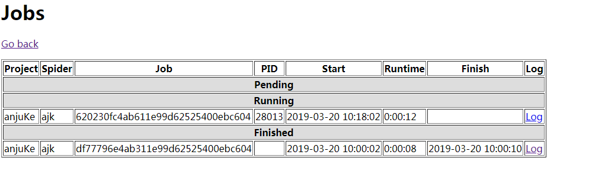


**mongodb中查看结果**

```
> db.anjuke.findOne()
{
	"_id" : ObjectId("5c91473f399203951f1deae9"),
	"title" : "大商汇 希望汇小区 月付无中介 精装修带家具家电 新房装修",
	"img_url" : "https://pic1.ajkimg.com/display/hj/48de60badf036d66fc28d55b44a6b0ae/240x180m.jpg?t=1",
	"info" : "\n                            1室0厅",
	"price" : "1120",
	"addr" : ",希望汇,西山-大商汇 广福路,近希望路"
}
```


----


#使用Scrapy爬取马蜂窝游记

**简介：抓取每一个月的每一个地点的每一个用户的游记的简要信息，这里只简单的定义了要爬取的字段（用户名，标题，简述，点赞数**）

项目GitHub地址：https://github.com/luckyWu/Spider-project.git

---------------------------------------

**先浏览下网页**

**1.打开马蜂窝网站选择目的地页面（如下图）**

时间一共有12个月，每一月旅游地点又分成多页显示

<!-- more -->


-----

**2.通过观察每一页的地名都是通过AJAX来加载的**

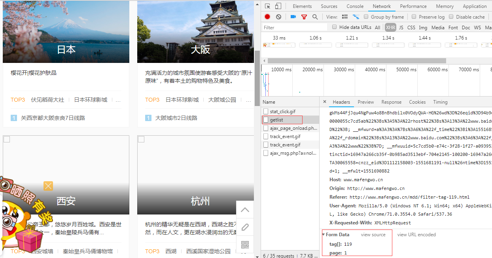


----


**3.任选一个目的地点入,往下面滑动将看到用户的旅游日记**


**上图中的每一个游记的简介便是要抓取的信息**

------


**开始项目**

**1.安装scrpay **

```
ubuntu 安装
sudo apt-get install build-essential python3-dev libssl-dev libffi-dev libxml2
libxml2-dev libxslt1-dev zlib1g-dev

pip3 install Scrapy
-----------------------------------------------------------------------------------------------
windows 安装
安装包下载地址：https://www.lfd.uci.edu/~gohlke/pythonlibs/
1.首先下载whl包
下载Scrapy-1.5.1-py2.py3-none-any.whl
2.安装wheel库的请先安装pip install wheel
3.scrapy依赖twiste
下载Twisted-18.9.0-cp37-cp37m-win_amd64.whl
4.scrapy依赖lxml包
pip install lxml
如遇到需要下载 pywin32，请下载安装
pip install pypiwin32
6.安装pip install scrapy

```

**2.创建项目**

```
#在命令提示符下输入
scrapy startproject myscrapy  #myscrapy为项目名称
```

**3.进入项目创建spider**

```
scrapy genspider football www.mafengwo.cn
```

**4.用pycharm打开**

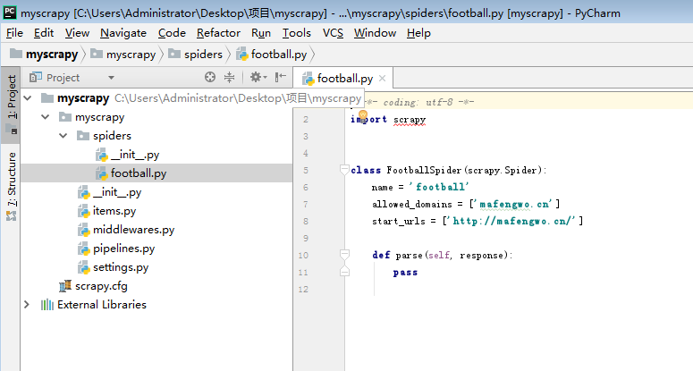


**5.编写item**

```
import scrapy

class MyscrapyItem(scrapy.Item):

    title = scrapy.Field() # 标题
    content = scrapy.Field() # 简介
    zan = scrapy.Field() #获赞
    user_name = scrapy.Field() #用户名
```


**6.配置MySQL，使用pymysql连接**

* 创建数据库时要设置utf8bm4格式， 因为抓取的数据中有图形符号字符

```
import pymysql

def get_con():
    """连接数据库"""
    host = '127.0.0.1'
    port = 3306
    user = 'root'
    password = '123456'
    database = 'mfw_trip1'
    db = pymysql.connect(host=host, user=user, password=password, database=database, charset='utf8mb4', port=port)
    return db

def get_cursor(db):
    """获取游标对象"""
    cursor = db.cursor()
    return cursor

def insert(db, cursor, item):
    """插入数据"""
    cursor.execute(
        query='insert into commits(title, content, zan, user_name) values (%s,%s,%s,%s)',
        args=( item['title'], item['content'], item['zan'], item['user_name']))
    db.commit()
```

**7.setting配置**

* ```
  robots要设置为False, 重试次数使用的话通过scrapy.contrib.downloadermiddleware.retry.RetryMiddleware配置
  ```

* 配置logging记录错误

  错误级别有5个

  CRITICAL - 严重错误 

  ERROR - 一般错误 

  WARNING - 警告信息 

  INFO - 一般信息 

  DEBUG - 调试信息

```
import datetime
today = datetime.datetime.now()
log_file_path = "log/{}-{}-{}.log".format(today.year, today.month, today.day)
LOG_LEVEL= 'WARNING'
LOG_FILE =log_file_path
```


**8.编写spider**

* 通过观察地点列表和游记列表都是发ajax的POST请求加载的，都有请求参数，通过观察地点列表的ajax请求的参数和月份和有关其中 'tag[]' = 113 + month（初始为0） * 3, page（初始为1）的值则可以通过下一页的链接取到，

* 游记列表的关键请求参数有'mddid',  'page',  '_ts',  '_sn',其中mddid代表一个城市，ts看起来像时间戳的格式，笔者用随机数伪造，sn用随机字符伪造


```
import json 
import logging

import time
from lxml import etree
import re
from scrapy import Spider, Request
from scrapy import FormRequest
from myscrapy.items import MyscrapyItem
import random

ALL_CHARS = '0123456789abcdefghijklmnopqrstuvwxyz'

def random_sn():
    """生成随机字符串"""

    s = ''
    chars_len = len(ALL_CHARS)
    for _ in range(10):
        index = random.randrange(chars_len)
        s += (ALL_CHARS[index])
    return s

def random_ts():
    """伪造随机时间戳"""
    str = '0123456789'
    s = ['155', '153']
    k = random.choice(s) + ''.join(random.choice(str) for i in range(10))
    return k

class FootballSpider(Spider):
    """解析网页"""

    name = 'football'
    allowed_domains = ['mafengwo.cn']
    start_urls = ['http://mafengwo.cn/']
    every_month_url = 'http://www.mafengwo.cn/mdd/base/filter/getlist'
    travel_url = 'http://www.mafengwo.cn/gonglve/ajax.php?act=get_travellist'
    base_month = 113
    params = {
        'mddid': '10189',
        'pageid': 'mdd_index',
        'sort': '1',
        'cost': '0',
        'days': '0',
        'month': '0',
        'tagid': '0',
        'page':'1',
        '_ts': random_ts(),
        '_sn': random_sn(),
    }
    month_params = {
        'tag[]': '113',
        'page': '1'
    }

    def start_requests(self):
    	"""重写starts_requests()函数生成请求"""
        for month in range(0, 13):
            # 构建请求参数
            tag = 113 + month * 3
            month_num_params = self.month_params
            month_num_params['tag[]'] = str(tag)
            yield FormRequest(self.every_month_url, callback=self.parse, 			      formdata=month_num_params)

    def parse(self, response):
        """解析每一页的每一个地点"""

        if response.status == 200 :
            res = json.loads(response.text)
            s = res.get('list', 0)

            if s:
                page_month = res.get('page', 0)
                # 提取下一页的请求参数
                obj = re.compile(r'<a rel="nofollow" data-page="(\d+)" href') 
                obj1 = re.search(obj, page_month)
                html = etree.HTML(s)
                lis = html.xpath('//li[@class="item"]')
                for li in lis[:]:
                    href = li.xpath('./div[@class="img"]/a/@href')[0]
                    print(href,'show href--------')
                    mdds = href.split('/')[-1]
                    mdd = mdds.split('.')[0]
                    month_page_params = self.params
                    month_page_params['mddid'] = mdd
                    yield FormRequest(self.travel_url, callback=self.parse_travellist, formdata=month_page_params)
                if obj1:
                    month_page_next_params = self.params
                    month_page_next_params['page'] = obj1.group(1)
                    yield FormRequest(self.every_month_url, callback=self.parse,
                                      formdata=month_page_next_params)
        logging.warning("parse_list失败")

    def parse_travellist(self, response):
        """得到每一个地点的游记列表"""
        # print("into parse_travellist************************************")
        if response.status == 200 :
            print("enter")
            res = response.text
            content = json.loads(res)
            s = content.get('list', 0)
            page_info = content.get('page',0)
            #提取下一页的请求参数
            next = re.compile(r'<a class="pi pg-next" href="/yj/(\d+)/1-0-(\d+).html" title')
            next = re.search(next,page_info)

            if s:
                s = "<html>" + s + "</html>"
                html = etree.HTML(s)
                lis = html.xpath('//div[@class="tn-item clearfix"]')
                for li in lis[:]:
                    href1 = li.xpath('.//a[@class="title-link"]//@href')[0]
                    title = li.xpath('.//a[@class="title-link"]/text()')#('./div[@class="tn-wrapper"]/dl/dt/a/text()')
                    content = li.xpath('./div[@class="tn-wrapper"]/dl/dd/a/text()')
                    zan = li.xpath('./div[@class="tn-wrapper"]/div/span[@class="tn-ding"]/em/text()')
                    user_name = li.xpath('./div[@class="tn-wrapper"]/div/span[@class="tn-user"]/a/text()')
                    item = MyscrapyItem()
                    item['title'] = title[0] if title else ''
                    item['content'] = content[0] if content else ''
                    item['zan'] = zan[0] if zan else ''
                    item['user_name'] = user_name[0] if user_name else ''
                    yield item
                    # url = 'http://www.mafengwo.cn' + href1
                    # yield Request(url, callback=self.parse_detail, dont_filter=False)
                if next:
                    next_page = next.group(1) #获取参数midde的值
                    next_num = next.group(2) #获取参数page的值
                    every_page_params = self.params
                    every_page_params['mddid'] = next_page
                    every_page_params['page'] = next_num
                    yield FormRequest(self.travel_url, callback=self.parse_travellist,dont_filter=False, formdata=every_page_params)
            else:
                logging.warning(f"parse_travellist失败！：{response.status}")

    # def parse_detail(self, response):
    #     """每一个游记的详细内容"""
    #     print(response.text)
```


**9.middlewares**

笔者爬取前就买了蘑菇代理准备对付封IP, 不知道为什么马蜂窝的反爬降低了，前几个月我试过直接是封一个网段的ip，笔者暂时就不用代理IP了。

笔者买的蘑菇代理每次有提取频率限制，提取后还要等一会才能重新提取，为了充分利用每一个代理IP，笔者用队列来保存代理IP，每次从队列取出一个直到该ip失效再重取，下面是蘑菇代理的调用函数

```
import time
import re

#from fake_useragent import UserAgent

q = deque(maxlen=50)

def getip():
    time.sleep(10)
    url='your key'
    # ip数小于3添加ip
    if len(q) < 3:
        res = requests.get(url)
        ips = (res.content.decode('utf-8'))
        if re.match(r'\d+\.', ips):
            ip = ips.split('\r\n')
            for i in ip[:5]:
                proxy = 'http://'+i
                q.append(proxy)
 curent_ip = pop()
```

**用Navicat连上数据库看一看效果**

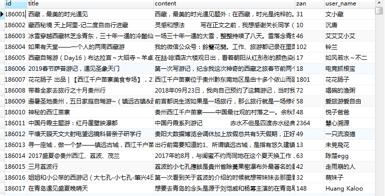

------------

------------

# numpy+matplotlib分析彩票趋势

**目的：抓取彩票数据并将其可视化**

以重庆时时彩为例（十分钟开一次，每一期开奖号码有五位）http://caipiao.163.com/award/cqssc/

这里抓取每一期的开奖号码、十位、个位、后三形态


**1.获取彩票数据**

* 这里获取2015-2018的数据
* requests请求，Xpath解析
* 使用装饰器实现错误重试


**请求失败重试的装饰器实现**

```
from functools import wraps
from time import sleep
from random import randint

# 失败重试，最多重试3次
def retry(times=3, max_wait=6, errors=(Exception,)):
	def decorate(func):
		@wraps(func)
		def wrapper(*args, **kwargs):
			for _ in range(times):
				try:
					return func(*args, **kwargs)
				except errors:
					sleep(randint(3,max_wait))
		return wrapper
	return decorate
```


**mongodb连接函数**

使用mongodb存储每一天的彩票，每一天的日期对应每一天的所有期号，先看看存储结构

```
{
	"_id" : "20150101",
	"20150101" : [
		{
			"id" : 1,
			"issue" : 1,
			"num" : "4 0 3 0 3",
			"tenth" : "小双",
			"bit" : "小单",
			"last3" : "组三"
		},
		{
			"id" : 2,
			"issue" : 2,
			"num" : "4 9 5 5 8",
			"tenth" : "大单",
			"bit" : "大双",
			"last3" : "组三"
		}
		]
}
```

**新建mongodb_help.py文件，编写插入、查询等功能**

```
import pymongo
import json, re
from functools import wraps
from time import sleep
from random import randint

client = pymongo.MongoClient('mongodb://127.0.0.1:27017')
db = client['CaiPiao']
def insert_comp(dic):
	db.com2.insert_one(dic)

def findone(num):
	return db.com2.find_one(num)
```


**新建get_cai.py文件获取彩票数据**

* datetime.datetime.strftime() :日期格式转化为字符串格式 
* datetime.datetime.strptime() :字符串格式转化为日期格式 
* datetime.timedelta():两个时间之间的时间差 

编写一个User-Agent函数

```
import random

def get_random_agent():
	agent_list = [
	"Mozilla/4.0 (compatible; MSIE 6.0; Windows NT 5.1; SV1; AcooBrowser; .NET CLR 1.1.4322; .NET CLR 2.0.50727)",
        "Mozilla/4.0 (compatible; MSIE 7.0; Windows NT 6.0; Acoo Browser; SLCC1; .NET CLR 2.0.50727; Media Center PC 5.0; .NET CLR 3.0.04506)",
        "Mozilla/4.0 (compatible; MSIE 7.0; AOL 9.5; AOLBuild 4337.35; Windows NT 5.1; .NET CLR 1.1.4322; .NET CLR 2.0.50727)",
        "Mozilla/5.0 (Windows; U; MSIE 9.0; Windows NT 9.0; en-US)",
        "Mozilla/5.0 (compatible; MSIE 9.0; Windows NT 6.1; Win64; x64; Trident/5.0; .NET CLR 3.5.30729; .NET CLR 3.0.30729; .NET CLR 2.0.50727; Media Center PC 6.0)",
        "Mozilla/5.0 (compatible; MSIE 8.0; Windows NT 6.0; Trident/4.0; WOW64; Trident/4.0; SLCC2; .NET CLR 2.0.50727; .NET CLR 3.5.30729; .NET CLR 3.0.30729; .NET CLR 1.0.3705; .NET CLR 1.1.4322)",
        "Mozilla/4.0 (compatible; MSIE 7.0b; Windows NT 5.2; .NET CLR 1.1.4322; .NET CLR 2.0.50727; InfoPath.2; .NET CLR 3.0.04506.30)",
        "Mozilla/5.0 (Windows; U; Windows NT 5.1; zh-CN) AppleWebKit/523.15 (KHTML, like Gecko, Safari/419.3) Arora/0.3 (Change: 287 c9dfb30)",
        "Mozilla/5.0 (X11; U; Linux; en-US) AppleWebKit/527+ (KHTML, like Gecko, Safari/419.3) Arora/0.6",
        "Mozilla/5.0 (Windows; U; Windows NT 5.1; en-US; rv:1.8.1.2pre) Gecko/20070215 K-Ninja/2.1.1",
        "Mozilla/5.0 (Windows; U; Windows NT 5.1; zh-CN; rv:1.9) Gecko/20080705 Firefox/3.0 Kapiko/3.0",
        "Mozilla/5.0 (X11; Linux i686; U;) Gecko/20070322 Kazehakase/0.4.5",
        "Mozilla/5.0 (X11; U; Linux i686; en-US; rv:1.9.0.8) Gecko Fedora/1.9.0.8-1.fc10 Kazehakase/0.5.6",
        "Mozilla/5.0 (Windows NT 6.1; WOW64) AppleWebKit/535.11 (KHTML, like Gecko) Chrome/17.0.963.56 Safari/535.11",
        "Mozilla/5.0 (Macintosh; Intel Mac OS X 10_7_3) AppleWebKit/535.20 (KHTML, like Gecko) Chrome/19.0.1036.7 Safari/535.20",
        "Opera/9.80 (Macintosh; Intel Mac OS X 10.6.8; U; fr) Presto/2.9.168 Version/11.52",
	]
	agent = random.choice(agent_list)
	return agent
```

获取彩票

```
import requests
import json, re
import time
import datetime
from lxml import etree
from mongo_help import insert_comp,retry
from random import randint
from agent_helper import get_random_agent
k = 1
headers = {'User-Agent':get_random_agent()
}
# f = open('CP.csv','a')
# f_csv = csv.writer(f)
	
@retry()
def get(date):
	global k
	url = 'http://caipiao.163.com/award/cqssc/'+date+'.html'
	res = requests.get(url, headers=headers, timeout=8)
	print('------------------------------------')
	if res.status_code==200:	
		lists =[]
		html = res.content.decode('utf-8')
		con = etree.HTML(html)
		tr = con.xpath('//div[@class="lottery-results"]')[0]
		num = tr.xpath('.//td[@class="award-winNum"]/text()') #开奖号码
		td1 = tr.xpath('.//td[@class="award-winNum"]//following-sibling::td[1]/text()') # 十位
		td2 = tr.xpath('.//td[@class="award-winNum"]//following-sibling::td[2]/text()') # 个位
		td3 = tr.xpath('.//td[@class="award-winNum"]//following-sibling::td[3]/text()') # 后三形态
		length = len(num)
		for n in range(0,length):
			dic = {}
			dic['id'] = k 
			dic['issue'] = n+1 # 期号
			dic['num'] = num[n]
			dic['tenth'] = td1[n]
			dic['bit'] = td2[n]
			dic['last3'] = td3[n]
			# f_csv.writerow([k,n+1,num[n],td1[n],td2[n],td3[n]])
			lists.append(dic)
			k += 1
		return lists


def main():
	tstart_str = '2015-01-01 00:00:00'
	tend_str = '2018-01-01 00:00:00' 
	# 日期格式转化为字符串格式 
	dstart = datetime.datetime.strptime(tstart_str, '%Y-%m-%d %H:%M:%S') 
	dend = datetime.datetime.strptime(tend_str, '%Y-%m-%d %H:%M:%S') 
	# print(dend,type(dend))
	# now = datetime.datetime.now()

	while dstart < dend: 
	    a = dstart.strftime('%Y-%m-%d') # 转字符串
	    print(a)
	    date = a.replace('-','')
	    res = get(date)
	    dics = {}
	    dics['_id'] = date
	    dics[date] = res
	    insert_comp(dics)
	    delta = datetime.timedelta(days=1) 
	    dstart = dstart + delta # 返回的是datetime型


if __name__ == "__main__":
	s = time.time()
	main()
	e = time.time()
	print(f'{e-s}秒')
```

-----


**2.分析彩票数据**

这里选每一期的最后两个号码分析

**1.安装numpy和matplotlib**

笔者安装了anaconda，里面就已经包含numpy和matplotlib

**2.新建show_cai.py文件编写可视化功能**

```
import pandas as pd
import numpy as np
from mongo_help import insert_comp, findone
from random import randint
import matplotlib.pyplot as plt

lis1 = []
lis2 = []

def get_mongo(data):
    s = findone({'_id': data})
    return s


def get(mongo_data, s_p=0, e_p=120):

    """
    mongo_data: 需要的数据
    s_p : 开始期号 (大于等于0)
    e_p : 结束期号（小于等于120）
    """
    i = 0
    s = mongo_data

    # a = np.random.randint(10, size=120)
    # b = np.random.randint(10, size=120)

    for li in s[gg][s_p:e_p]:
        n = li['num'][-3] # 每一期5个开奖号码中第4个号码
        n1 = li['num'][-1] # 每一期5个开奖号码中第5个号码
        lis1.append(int(n))
        lis2.append(int(n1))
        i += 1
    return e_p - s_p

def plot(k=120):
    """折线图"""

    plt.figure(figsize=[12.8, 9.6]) # figsize：指定图片大小
    plt.xlabel('issue') # 期号
    plt.ylabel('Winning numbers') # 中奖号码
    plt.title('plot')
    plt.plot(np.arange(k), lis1, label='fourth num')
    plt.plot(np.arange(k), lis2, label='fifth num')
    plt.legend()
    plt.show()


def scatter(k=120):
    """散点图"""
    plt.figure(figsize=[12.8, 9.6])
    plt.xlabel('issue') # 期号
    plt.ylabel('Winning numbers') # 中奖号码
    plt.title('scatter')
    plt.scatter(np.arange(k), lis1, label='fourth num')
    plt.scatter(np.arange(k), lis2, label='fifth num')
    plt.legend()
    plt.show()

def ws(k):
    """多个显示"""
    fig = plt.figure(figsize=[12.8, 9.6])
    fig.add_subplot(2, 2, 1)
    plt.xlabel('issue') # 期号
    plt.ylabel('Winning numbers') # 中奖号码
    # 直⽅图
    plt.hist(lis1, bins=10, color='r',edgecolor='black',label='fourth num') # edgecolor：边框颜色
    plt.legend()
    fig.add_subplot(2, 2, 2)
    # 散点图
    plt.scatter(np.arange(k), lis1, label='fourth num')
    plt.legend()
    plt.xlabel('issue') # 期号
    plt.ylabel('Winning numbers') # 中奖号码
    plt.title('scatter')
    fig.add_subplot(2, 2, 3)
    # 折线图
    plt.xlabel('issue') # 期号
    plt.ylabel('Winning numbers') # 中奖号码
    plt.plot(np.arange(k), lis1, label='fourth num')
    plt.legend()
    plt.show()

if __name__ == "__main__":

    gg = '20170111'
    d = get_mongo(gg)
    k = get(d)
    ws(k)
    # plot(k)
    # scatter(k)

    # b = [1,2,3]

    # print(b[-3:1])
```


**效果**

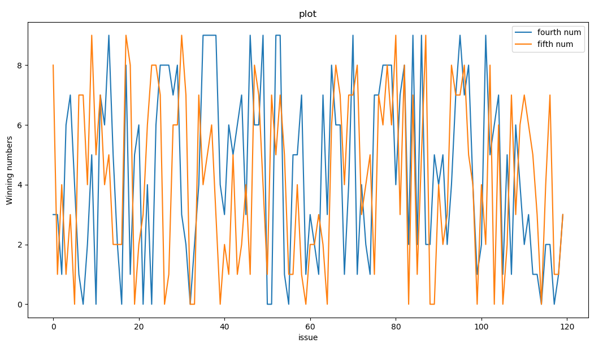


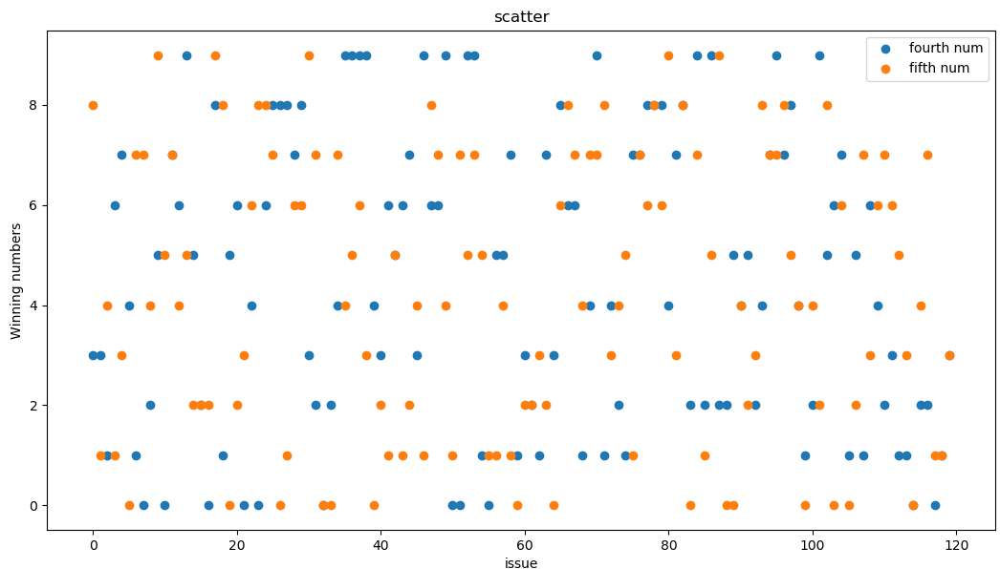

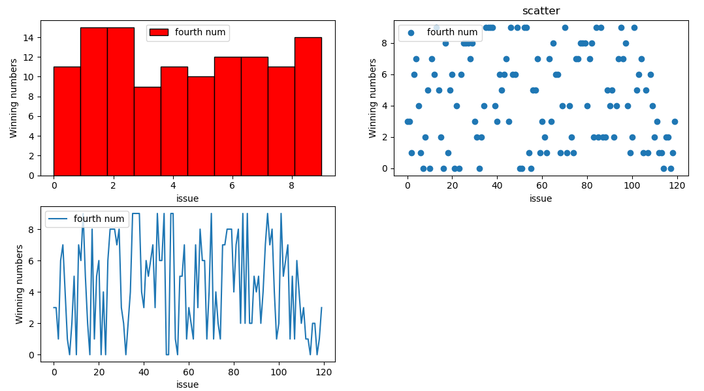

----

---

#（Scrapy+代理池+Cookie池）爬取全书网

**目标:爬取每一个小说每一章节的内容**

---

**1.首先浏览下目标网站**


**2.随意点击一个小说进去**


**3.点击“开始阅读”**

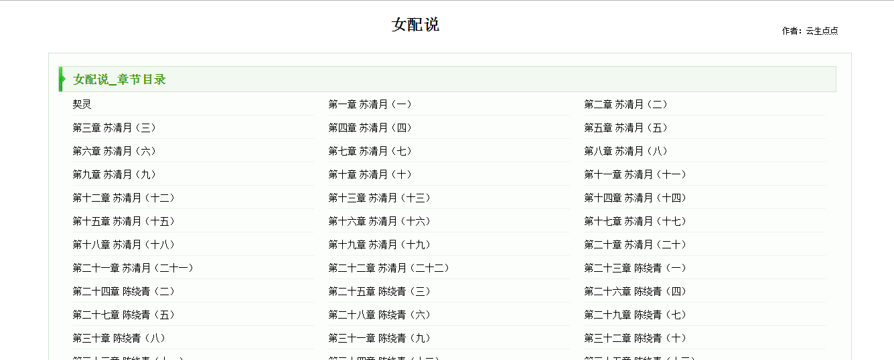

**4.随意点击一章节进入**

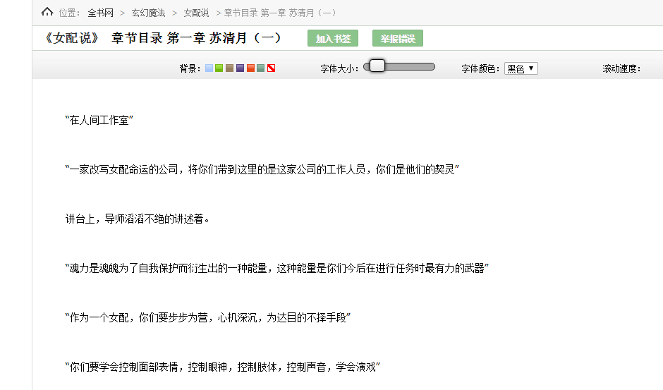

---


**1.分析网页结构，打开开发者工具，对排行列表页进行分析**

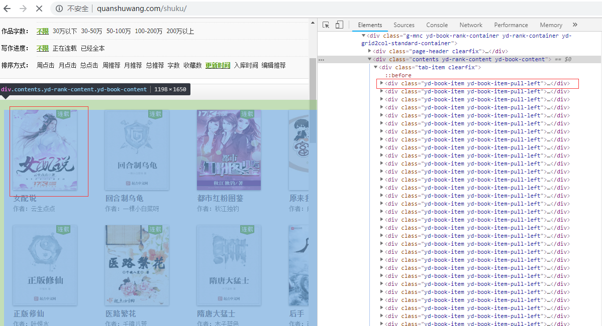


----

* **对每一个小说分析可以得到小说标题等信息，点击href连接进入**

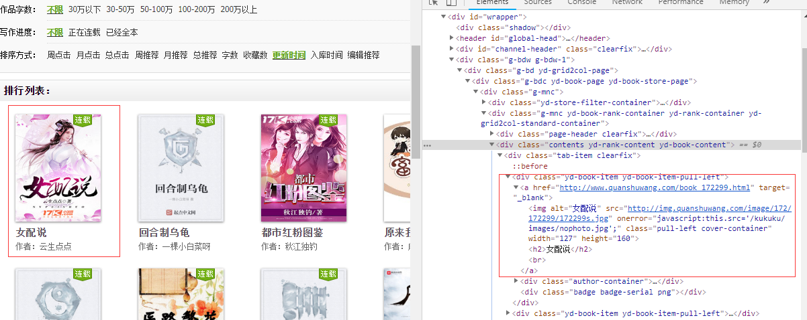


----

* **选中"开始阅读**

**对页码进行分析可以得出下一页的地址**

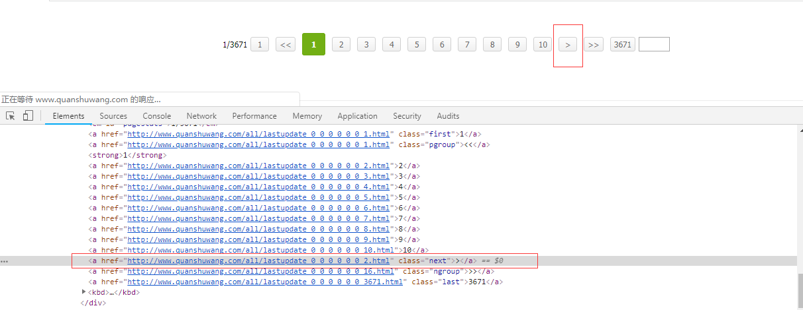


**开始编程**

**1.新建一个Scrapy工程，用PyCharm打开**

**2.新建一个spider, 输入命令scrapy genspider crawl  quanshuwang.com quanshu**

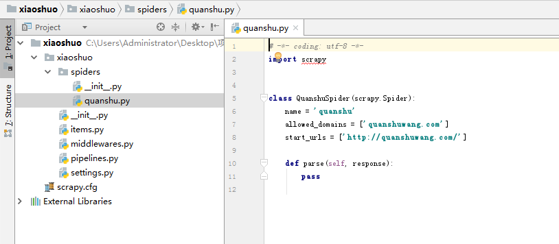

**3.编写item**

简单定义了下小说名称，小说章节和小说内容

```
class XiaoshuoItem(scrapy.Item):

    title = scrapy.Field()
    page = scrapy.Field()
    content = scrapy.Field()
```

**4.使用代理池和cookie**

不采取任何措施，很快过一段时间便全部返回403，只用代理一段时间后也被封了

这里笔者就参考网上大神写的cookie池顺便练一下搭cookie池，大家想搭cookie池也可以借鉴笔者的：

由于全书网注册比较简单可以注册多个账户，笔者注册了20个账号用于获取cookies，笔者设定每隔一段时间就清掉一半，并通过selenium登录获取cookie存放在redis中，采用flask做接口以便调用


**使用Redis可视化工具 Redis Desktop Manager 来查看效果**


**在浏览器中调用接口看看效果**

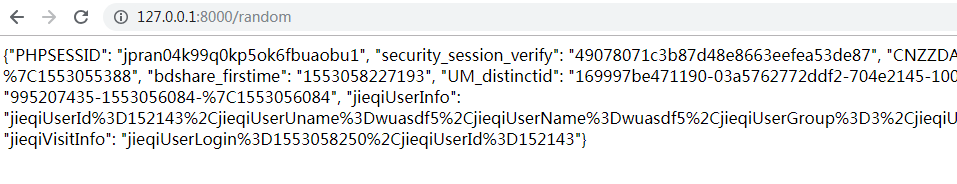


**代理池搭建**

笔者使用蘑菇代理来获取代理，但获取有限制，为了更好的利用笔者搭了个代理池进行维护，笔者的代理池部署在腾讯云上, 使用redis有序集合存储，不断地获取IP和检测IP(用百度检测)，获取的IP初始10分，检测合格变成100分，不合格减去10分，当分数小于等于0删除。

连接redis看一下

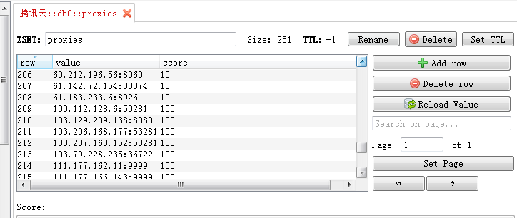

**获取代理和cooike**

```
def get_ip():
    s = requests.get('http://129.28.109.42:5000/random')
    if s.status_code== 200:
        ip = 'http://' + s.text
        return ip
    return None

def get_cookie():
    url = 'http://127.0.0.1:8000/random'
    s = requests.get(url)
    if s.status_code == 200:
        return json.loads(s.text)
    else:
        return {}
```


**编写下载中间件设置代理和cookie**

```
class XiaoshuoDownloaderMiddleware(object):
       
       def process_request(self, request, spider):
            """设置代理ip和cookie"""
            ua = UserAgent()
            request.headers.setdefault("User-Agent", ua.random) # 随机请求头
            request.meta['proxy'] =  get_ip()
            cookie = get_cookie()
            if cookie:
                request.cookies = cookie

        def process_response(self, request, response, spider):
            if response.status in [403]:
                try:
                    request.cookies = get_cookie()
                    print('403---------------------')
                    request.meta['proxy'] = get_ip()
                    return request
                except Exception:
                    raise IgnoreRequest
            else:
                return response
```


**5.编写spider**

* 首先获取全部书籍链接（使用下一页的链接继续获取）
* 获取每本书籍的全部章节链接
* 获取每个章节的内容

```

class QuanshuSpider(Spider):
    name = 'quanshu'
    allowed_domains = ['quanshuwang.com']
    start_urls = ['http://quanshuwang.com/']
    list_url = 'http://www.quanshuwang.com/shuku/'

    def start_requests(self):
        yield Request(self.list_url, dont_filter=True, callback=self.parse)

    def parse(self, response):
        """小说列表解析"""
        if response.status == 200:
            results =  response.text
            html = etree.HTML(results)
            if html:
                # 获取每本小说链接
                next = html.xpath('//a[@class ="next"]/@href')
                target = html.xpath('//div[@class="contents yd-rank-content yd-book-content"]')[0]
                lis = target.xpath('.//div[@class="yd-book-item yd-book-item-pull-left"]')
                for li in lis[:]:
                    href = li.xpath('./a/@href')
                    # auth = li.xpath('.//dl[@class="dl-horizontal-inline"]//p/text()')[0]
                    if href:
                        yield Request(href[0], dont_filter=True, callback=self.brief_parse)
                # 下一页
                if next:
                    yield Request(next[0], self.parse)

    def brief_parse(self, response):
        """小说简述解析"""
        if response.status == 200:
            results =  response.text
            html = etree.HTML(results)
            if html:
                chapter_href = html.xpath('//div[@class="b-oper"]/a/@href')
                if chapter_href:
                    yield Request(chapter_href[0],dont_filter=True,  callback=self.chapter_parse)

    def chapter_parse(self, response):
        """章节列表"""
        if response.status == 200:
            results =  response.text
            html = etree.HTML(results)
            if html:
                # 获取每一章节链接
                chapters = html.xpath('//div[@class="clearfix dirconone"]//li')
                if chapters:
                    for chapter in chapters[:]:
                        chapter_name = chapter.xpath('./a/text()')
                        content_href = chapter.xpath('./a/@href')
                        if content_href:
                            yield Request(content_href[0],dont_filter=True, callback=self.content_parse)


    def content_parse(self, response):
        """每章内容"""
        if response.status == 200:
            html = etree.HTML(response.text)
            if html:
                title = html.xpath('//em[@class="l"]/text()')
                page = html.xpath('//strong[@class ="l jieqi_title"]/text()')
                content = html.xpath('//div[contains(@class, "mainContenr") and @id="content"]/text()')

                item = XiaoshuoItem()
                item['title'] = title[0] if title else ''
                item['page'] = page[0] if page else ''
                item['content'] = content
                yield item

```


**6.数据清洗和配置setting**

获得的每一章小说都是有格式的，它是一行一行的数据，通过观察获取到的数据包含‘\\n’，‘\\xa0’等字符，笔者现将其去掉，并变成一段一段的数据，编写process_item方法

```
def process_item(self, item, spider):
    page = item['page']
    fpage = page
    fcontent = item['content']
    # 去格式
    content = re.sub(r'[\'\\r\\n,|\\xa0|\[|\]](\\xa0){0,4}', '', str(fcontent))
    if fpage:
        item['page'] = fpage
        item['content'] = content
        self.db[self.collection_name].insert(dict(item))
        #update({'url': item['url']}, dict(item), True)
    return item
```

* setting中配置自动限速降低请求频率

```
AUTOTHROTTLE_ENABLED = True
DOWNLOAD_DELAY = 1
```


* setting中mongodb配置

```
MONGO_URL = '127.0.0.1'
MONGO_DATABASE = 'quan_shu_wang'
```

## 	

**效果展示**

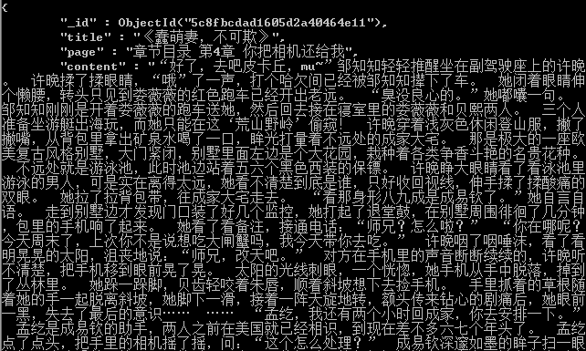


```
# 查询分组(这里制定了分组字段 $+字段名)
db.xiaoshuo2.aggregate({'$group':{'_id':'$title','章节数':{'$sum':1}}})
```

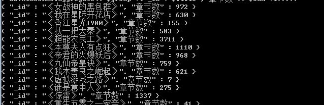


-------------------

-----------------

# selenium+验证码注册中国移动

**1.中国移动注册界面**

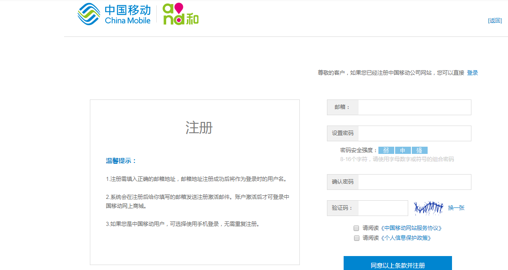

**2.使用超级鹰破解验证码**

对于不同的验证码，超级鹰收费不一样，下面是超级鹰的收费标准

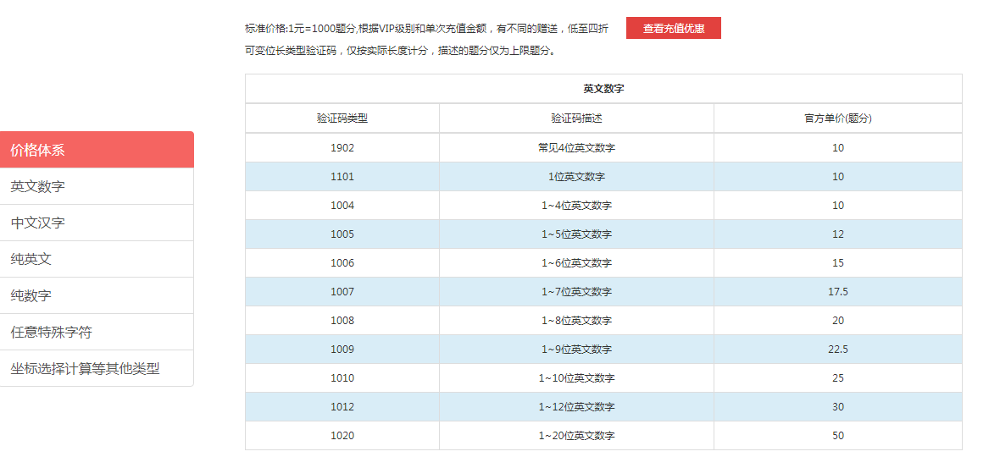

中国移动验证码是6位数字英文，这里选1006

**3.下载超级鹰接口文件,并设置好账户和验证类型**

```
import requests
from hashlib import md5

class Chaojiying_Client(object):

    def __init__(self, username, password, soft_id):
        self.username = username
        password =  password.encode('utf8')
        self.password = md5(password).hexdigest()
        self.soft_id = soft_id
        self.base_params = {
            'user': self.username,
            'pass2': self.password,
            'softid': self.soft_id,
        }
        self.headers = {
            'Connection': 'Keep-Alive',
            'User-Agent': 'Mozilla/4.0 (compatible; MSIE 8.0; Windows NT 5.1; Trident/4.0)',
        }

    def PostPic(self, im, codetype):
        """
        im: 图片字节
        codetype: 题目类型 参考 http://www.chaojiying.com/price.html
        """
        params = {
            'codetype': codetype,
        }
        params.update(self.base_params)
        files = {'userfile': ('ccc.jpg', im)}
        r = requests.post('http://upload.chaojiying.net/Upload/Processing.php', data=params, files=files, headers=self.headers)
        return r.json()

    def ReportError(self, im_id):
        """
        im_id:报错题目的图片ID
        """
        params = {
            'id': im_id,
        }
        params.update(self.base_params)
        r = requests.post('http://upload.chaojiying.net/Upload/ReportError.php', data=params, headers=self.headers)
        return r.json()

def main1(urlstr):
	"""urlstr为需要破解的图片验证码"""
	
	#前两个分别是账户和密码，后一个不用管
    chaojiying = Chaojiying_Client('cococo', '123456a', '96001') 
    im = open(urlstr, 'rb').read()                                                 
    return chaojiying.PostPic(im, 1006)['pic_str'] 
```


**4.新建文件并编写登陆程序**

* 1.获取浏览器窗口内全图 
* 2.获取验证码图片位置和宽高
* 3.利用Image模块中crop函数剪切验证码图片
* 4.获取网页中用户框、密码框等各个节点
* 5.模拟登陆

```
from selenium import webdriver
from selenium.common.exceptions import TimeoutException
from selenium.webdriver.common.by import By
from selenium.webdriver.support.ui import WebDriverWait
from selenium.webdriver.support import expected_conditions as EC
from urllib.parse import quote
from lxml import etree
from PIL import Image
from io import BytesIO
from chaojiying import main1
import time


chrome_options = webdriver.ChromeOptions()
# chrome_options.add_argument('--headless') 无头浏览器
browser = webdriver.Chrome(chrome_options=chrome_options)
# browser = webdriver.PhantomJS() 使用PhantomJS
browser.set_window_size(1400, 700) #设置窗口宽高
# 显式等待 针对某个节点的等待
wait = WebDriverWait(browser, 10)

def get_page():
    url = 'https://login.10086.cn/html/register/register.html'
    browser.get(url)
    html = browser.page_source
    return html


def get_big_image():
    """取浏览器窗口内全图"""

    screenshot = browser.get_screenshot_as_png()
    screenshot = Image.open(BytesIO(screenshot))
    return screenshot


def get_position():
	"""取验证码坐标位置（左上角和右下角）"""
	img = wait.until(EC.presence_of_element_located((By.CSS_SELECTOR, '#captchaImg')))
	loc = img.location
	size = img.size
	print(loc)
	print(size)
	x1 = loc['x']
	y1 = loc['y']
	x2 = loc['x'] + size['width']
	y2 = y1 + size['height']
	print(x1,y1,x2,y2)
	return (x1, y1, x2, y2)

def parse_html(html):
    # etree_html = etree.HTML(html)
    screenshot = get_big_image()
    screenshot.save('full_screen.png')
    x1, y1, x2, y2 = get_position()
    crop_image = screenshot.crop((x1, y1, x2, y2)) #获取验证码图片
    file_name = 'crop.png'
    crop_image.save(file_name)
    captha_str = main1(file_name) # 获取验证码
    
    # 用户名和密码
    username = '2418717998@qq.com'
    password = '12345678a'

    print(captha_str)
    # 选择节点
    input_emailname = wait.until(EC.presence_of_element_located
                       ((By.CSS_SELECTOR, 'input#loginName')))
    input_password1 = wait.until(EC.presence_of_element_located
                       ((By.CSS_SELECTOR, 'input#newPassword')))
    input_password2 = wait.until(EC.presence_of_element_located
                                 ((By.CSS_SELECTOR, 'input#newPasswordRepeat')))
    input_check = wait.until(EC.presence_of_element_located
                             ((By.CSS_SELECTOR, 'input#inputCode')))
    print('s1')
    sublime1 = wait.until(EC.element_to_be_clickable((By.CSS_SELECTOR, 'input#regText_bg_new')))
    print('s2')
    sublime2 = wait.until(EC.element_to_be_clickable((By.CSS_SELECTOR, 'input#regText_bg_person')))
    print('s3')
    sublime = wait.until(EC.element_to_be_clickable((By.CSS_SELECTOR, 'input.reg_btn.clearfix')))

    # 模拟登陆
    input_emailname.send_keys(username)
    input_password1.send_keys(password)
    input_password2.send_keys(password)
    input_check.send_keys(captha_str)

    time.sleep(2)
    sublime1.click()
    time.sleep(2)
    sublime2.click()
    time.sleep(2)
    sublime.click()
    time.sleep(2)
    html = browser.page_source

def main():
	html = get_page()
	parse_html(html)

if __name__ == '__main__':
	main()
```

---

**效果展示**

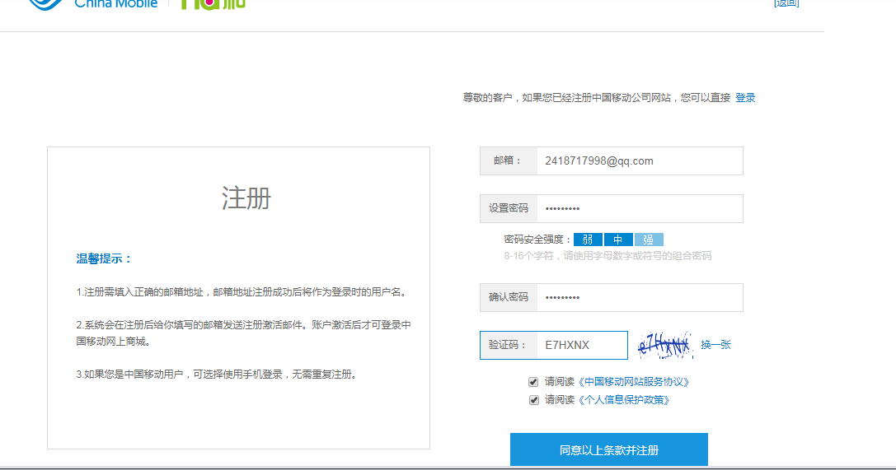

------------

---------------

# 爬取京东商品(selenium+MySQL)

**通过搜索关键字爬取相关的商品，这里笔者使用机器人作为关键字**


打开开发者工具，拖动滑条下拉发现发起了两次ajax请求，也就是说必须要将滑动条往下拉一定程度才会发ajax加载另一半的内容

**技术要点**

* selenium 模拟用户行为

* document.body.scrollHeight------浏览器滚动部分高度

* 使用execute_script()执行JS代码操作滚动条
* 通过JS中window.scrollTo函数把内容滚动到指定的坐标 
* 经过尝试滚动16次效果最好，可以获取所有商品数据
* 使用Xpath解析网页
* 创建数据库创建表


**1.SQL建表**

```
drop DATABASE if exists JD;
create database JD default charset utf8;
use JD;
create table jd_data(
	id int auto_increment primary key, 
	img varchar(1028),
	price varchar(580),
	shop_desc varchar(1028),
	commentNum varchar(580),
	store varchar(580),
	sku  varchar(580),
	href varchar(1028),
	store_link varchar(1028),
	create_time timestamp not null default current_timestamp
        );
```


**2.连接数据库**

新建JD_bd_insert.py文件，实现对接数据库

```
import pymysql

def get_con():
	host = '127.0.0.1'
	port = 3306
	user = 'root'
	password = '123456'
	database = 'JD'
	db = pymysql.connect(host=host,user=user,password=password,database=database,charset='utf8',port=port)
	return db

# 获取游标
def get_cursor(db):
	cursor = db.cursor()
	return cursor

# 插入数据
def insert(db,cursor,lists):
	for item in lists:
		print('进入sql语句')
		cursor.execute( query='insert into jd_data(img,price,shop_desc,commentNum,store,sku,href,store_link)values(%s,%s,%s,%s,%s,%s,%s,%s)',
                args=(item['img'],item['price'],item['shop_desc'],
				item['comment_num'],item['store'],item['sku'],item['href'],item['store_link']))
		db.commit()


def close(db):
	# 关闭连接
	db.close()


if __name__ == '__main__':
	db = get_con()
	cursor = get_cursor(db)
	result = cursor.execute(query='select * from mogu')
	# cursor.execute(query='alter table mogu add column free varchar(50)')
	datas = cursor.fetchall() # yuanzu
	new_id = 0
	for data in datas:
		new_id +=1
		print(data[0])
		cursor.execute(query='update mogu set free=%s where id=%s',args=(new_id,data[0]))
		db.commit()
		print(new_id)

```


**实现商品数据获取**

使用selenium实现

```
from selenium import webdriver
from selenium.common.exceptions import TimeoutException
from selenium.webdriver.common.by import By
from selenium.webdriver.support.ui import WebDriverWait
from selenium.webdriver.support import expected_conditions as EC
from urllib.parse import quote
from lxml import etree
import time,json
from JD_db_insert import *

chrome_options = webdriver.ChromeOptions()
browser = webdriver.Chrome(chrome_options=chrome_options)

browser.set_window_size(1400, 700)
wait = WebDriverWait(browser, 30)

def get_page(page):
	# browser.get('https://search.jd.com/Search?keyword=%E6%9C%BA%E5%99%A8%E4%BA%BA&enc=utf-8&qrst=1&rt=1&stop=1&vt=2&page=1&s=1&click=0')
	if page==1:
		url = 'https://www.jd.com'
		browser.get(url)
		input = wait.until(
			EC.presence_of_element_located((By.CSS_SELECTOR, '#key')))
		input.clear()
		input.send_keys('机器人')
		
		print('点击搜索按钮')
		submit = wait.until(
			EC.element_to_be_clickable((By.CSS_SELECTOR, '#search button.button')))
		submit.click()
		time.sleep(5)

	else:
		# 进入下一页
		input = wait.until(
			EC.presence_of_element_located((By.CSS_SELECTOR, '#J_bottomPage .input-txt')))
		input.clear()
		input.send_keys(page)

		submit = wait.until(
			EC.element_to_be_clickable((By.CSS_SELECTOR, '#J_bottomPage .btn.btn-default')))
		submit.click()

		time.sleep(2)

	 # 模拟操作滚动条
	for i in range(16):
		str_js = 'var step = document.body.scrollHeight / 16; window.scrollTo(0, step * %d)' % (i + 1)
		browser.execute_script(str_js)
		time.sleep(1)

	page_source = browser.page_source
	
	return page_source

def parse_page(page_source):

	"""获取商品信息"""

	html = etree.HTML(page_source)
	results = html.xpath('//li[@class="gl-item"]')
	list_data = []
	for result in results:
		dic = {}
		# print(result)
		img = result.xpath('.//div[@class="p-img"]/a/img/@src')
		price = result.xpath('.//div[@class="p-price"]//i/text()')
		shop_desc = result.xpath('.//div[@class="p-name p-name-type-2"]//em//text()')
		comment_num = result.xpath('.//div[@class="p-commit"]//a/text()')
		store = result.xpath('.//span[@class="J_im_icon"]/a/text()')
		store_link = result.xpath('.//span[@class="J_im_icon"]/a/@href')
		sku = result.xpath('./@data-sku')
		href = result.xpath('.//div[@class="p-img"]/a/@href')
		dic['sku'] = sku[0] if sku else ''
		dic['img'] = img[0] if img else ''
		dic['price'] = price[0] if price else ''
		dic['shop_desc'] = ''.join(shop_desc) if shop_desc else ''
		dic['comment_num'] = comment_num[0] if comment_num else ''
		dic['store'] = store[0] if store else ''
		dic['href'] = href[0] if href else ''
		dic['store_link'] = store_link[0] if store_link else ''
		# dic['page'] = str(page)
		list_data.append(dic)

	print('准备插入数据')
	insert(db,cursor,list_data)


def main():
	# 爬取100页商品
	for i in range(1,101):
		pages = get_page(i)
		# print(page_num)
		parse_page(pages)


if __name__ == '__main__':
	db = get_con()
	cursor = get_cursor(db)
	main()
	close(db)

if __name__ == '__main__':
	db = get_con()
	cursor = get_cursor(db)
	main()
	close(db)
```


**效果展示**


查看数据库

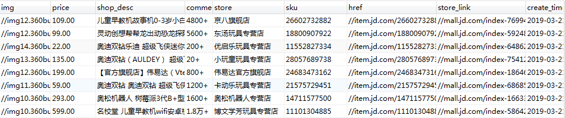


