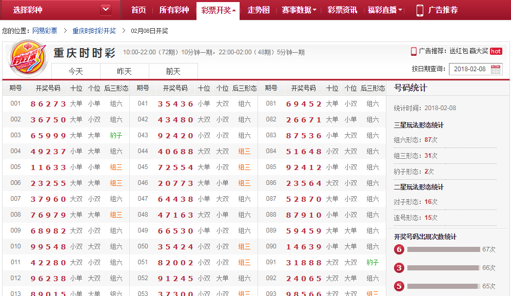
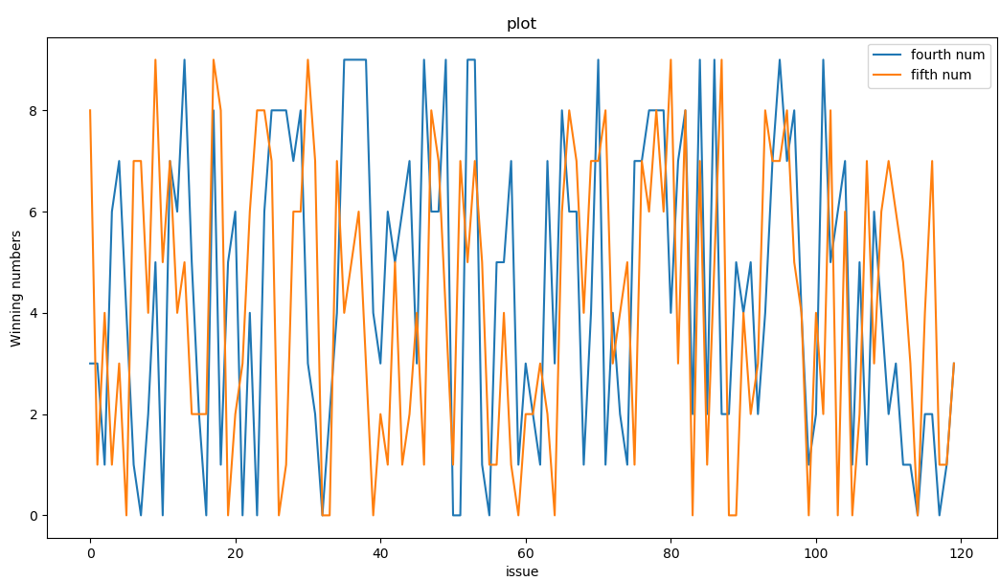
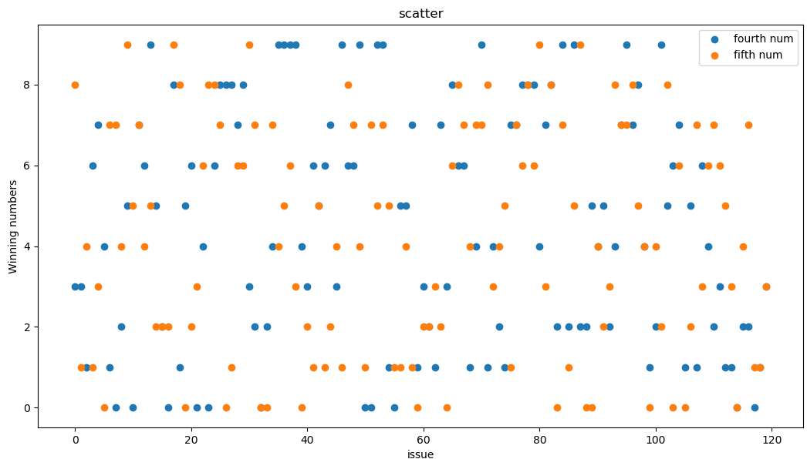
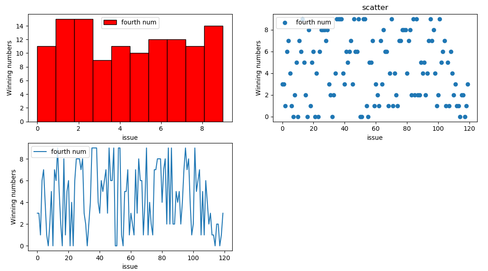

# numpy+matplotlib分析彩票趋势

**目的：抓取彩票数据并将其可视化**

以重庆时时彩为例（十分钟开一次，每一期开奖号码有五位）http://caipiao.163.com/award/cqssc/

这里抓取每一期的开奖号码、十位、个位、后三形态




**1.获取彩票数据**

* 这里获取2015-2018的数据
* requests请求，Xpath解析
* 使用装饰器实现错误重试


**请求失败重试的装饰器实现**

```
from functools import wraps
from time import sleep
from random import randint

# 失败重试，最多重试3次
def retry(times=3, max_wait=6, errors=(Exception,)):
	def decorate(func):
		@wraps(func)
		def wrapper(*args, **kwargs):
			for _ in range(times):
				try:
					return func(*args, **kwargs)
				except errors:
					sleep(randint(3,max_wait))
		return wrapper
	return decorate
```


**mongodb连接函数**

使用mongodb存储每一天的彩票，每一天的日期对应每一天的所有期号，先看看存储结构

```
{
	"_id" : "20150101",
	"20150101" : [
		{
			"id" : 1,
			"issue" : 1,
			"num" : "4 0 3 0 3",
			"tenth" : "小双",
			"bit" : "小单",
			"last3" : "组三"
		},
		{
			"id" : 2,
			"issue" : 2,
			"num" : "4 9 5 5 8",
			"tenth" : "大单",
			"bit" : "大双",
			"last3" : "组三"
		}
		]
}
```

**新建mongodb_help.py文件，编写插入、查询等功能**

```
import pymongo
import json, re
from functools import wraps
from time import sleep
from random import randint

client = pymongo.MongoClient('mongodb://127.0.0.1:27017')
db = client['CaiPiao']
def insert_comp(dic):
	db.com2.insert_one(dic)

def findone(num):
	return db.com2.find_one(num)
```


**新建get_cai.py文件获取彩票数据**

* datetime.datetime.strftime() :日期格式转化为字符串格式 
* datetime.datetime.strptime() :字符串格式转化为日期格式 
* datetime.timedelta():两个时间之间的时间差 

编写一个User-Agent函数

```
import random

def get_random_agent():
	agent_list = [
	"Mozilla/4.0 (compatible; MSIE 6.0; Windows NT 5.1; SV1; AcooBrowser; .NET CLR 1.1.4322; .NET CLR 2.0.50727)",
        "Mozilla/4.0 (compatible; MSIE 7.0; Windows NT 6.0; Acoo Browser; SLCC1; .NET CLR 2.0.50727; Media Center PC 5.0; .NET CLR 3.0.04506)",
        "Mozilla/4.0 (compatible; MSIE 7.0; AOL 9.5; AOLBuild 4337.35; Windows NT 5.1; .NET CLR 1.1.4322; .NET CLR 2.0.50727)",
        "Mozilla/5.0 (Windows; U; MSIE 9.0; Windows NT 9.0; en-US)",
        "Mozilla/5.0 (compatible; MSIE 9.0; Windows NT 6.1; Win64; x64; Trident/5.0; .NET CLR 3.5.30729; .NET CLR 3.0.30729; .NET CLR 2.0.50727; Media Center PC 6.0)",
        "Mozilla/5.0 (compatible; MSIE 8.0; Windows NT 6.0; Trident/4.0; WOW64; Trident/4.0; SLCC2; .NET CLR 2.0.50727; .NET CLR 3.5.30729; .NET CLR 3.0.30729; .NET CLR 1.0.3705; .NET CLR 1.1.4322)",
        "Mozilla/4.0 (compatible; MSIE 7.0b; Windows NT 5.2; .NET CLR 1.1.4322; .NET CLR 2.0.50727; InfoPath.2; .NET CLR 3.0.04506.30)",
        "Mozilla/5.0 (Windows; U; Windows NT 5.1; zh-CN) AppleWebKit/523.15 (KHTML, like Gecko, Safari/419.3) Arora/0.3 (Change: 287 c9dfb30)",
        "Mozilla/5.0 (X11; U; Linux; en-US) AppleWebKit/527+ (KHTML, like Gecko, Safari/419.3) Arora/0.6",
        "Mozilla/5.0 (Windows; U; Windows NT 5.1; en-US; rv:1.8.1.2pre) Gecko/20070215 K-Ninja/2.1.1",
        "Mozilla/5.0 (Windows; U; Windows NT 5.1; zh-CN; rv:1.9) Gecko/20080705 Firefox/3.0 Kapiko/3.0",
        "Mozilla/5.0 (X11; Linux i686; U;) Gecko/20070322 Kazehakase/0.4.5",
        "Mozilla/5.0 (X11; U; Linux i686; en-US; rv:1.9.0.8) Gecko Fedora/1.9.0.8-1.fc10 Kazehakase/0.5.6",
        "Mozilla/5.0 (Windows NT 6.1; WOW64) AppleWebKit/535.11 (KHTML, like Gecko) Chrome/17.0.963.56 Safari/535.11",
        "Mozilla/5.0 (Macintosh; Intel Mac OS X 10_7_3) AppleWebKit/535.20 (KHTML, like Gecko) Chrome/19.0.1036.7 Safari/535.20",
        "Opera/9.80 (Macintosh; Intel Mac OS X 10.6.8; U; fr) Presto/2.9.168 Version/11.52",
	]
	agent = random.choice(agent_list)
	return agent
```

获取彩票

```
import requests
import json, re
import time
import datetime
from lxml import etree
from mongo_help import insert_comp,retry
from random import randint
from agent_helper import get_random_agent
k = 1
headers = {'User-Agent':get_random_agent()
}
# f = open('CP.csv','a')
# f_csv = csv.writer(f)
	
@retry()
def get(date):
	global k
	url = 'http://caipiao.163.com/award/cqssc/'+date+'.html'
	res = requests.get(url, headers=headers, timeout=8)
	print('------------------------------------')
	if res.status_code==200:	
		lists =[]
		html = res.content.decode('utf-8')
		con = etree.HTML(html)
		tr = con.xpath('//div[@class="lottery-results"]')[0]
		num = tr.xpath('.//td[@class="award-winNum"]/text()') #开奖号码
		td1 = tr.xpath('.//td[@class="award-winNum"]//following-sibling::td[1]/text()') # 十位
		td2 = tr.xpath('.//td[@class="award-winNum"]//following-sibling::td[2]/text()') # 个位
		td3 = tr.xpath('.//td[@class="award-winNum"]//following-sibling::td[3]/text()') # 后三形态
		length = len(num)
		for n in range(0,length):
			dic = {}
			dic['id'] = k 
			dic['issue'] = n+1 # 期号
			dic['num'] = num[n]
			dic['tenth'] = td1[n]
			dic['bit'] = td2[n]
			dic['last3'] = td3[n]
			# f_csv.writerow([k,n+1,num[n],td1[n],td2[n],td3[n]])
			lists.append(dic)
			k += 1
		return lists


def main():
	tstart_str = '2015-01-01 00:00:00'
	tend_str = '2018-01-01 00:00:00' 
	# 日期格式转化为字符串格式 
	dstart = datetime.datetime.strptime(tstart_str, '%Y-%m-%d %H:%M:%S') 
	dend = datetime.datetime.strptime(tend_str, '%Y-%m-%d %H:%M:%S') 
	# print(dend,type(dend))
	# now = datetime.datetime.now()

	while dstart < dend: 
	    a = dstart.strftime('%Y-%m-%d') # 转字符串
	    print(a)
	    date = a.replace('-','')
	    res = get(date)
	    dics = {}
	    dics['_id'] = date
	    dics[date] = res
	    insert_comp(dics)
	    delta = datetime.timedelta(days=1) 
	    dstart = dstart + delta # 返回的是datetime型


if __name__ == "__main__":
	s = time.time()
	main()
	e = time.time()
	print(f'{e-s}秒')
```


### 2.分析彩票数据

这里选每一期的最后两个号码分析

**1.安装numpy和matplotlib**

笔者安装了anaconda，里面就已经包含numpy和matplotlib

**2.新建show_cai.py文件编写可视化功能**

```
import pandas as pd
import numpy as np
from mongo_help import insert_comp, findone
from random import randint
import matplotlib.pyplot as plt

lis1 = []
lis2 = []

def get_mongo(data):
    s = findone({'_id': data})
    return s


def get(mongo_data, s_p=0, e_p=120):

    """
    mongo_data: 需要的数据
    s_p : 开始期号 (大于等于0)
    e_p : 结束期号（小于等于120）
    """
    i = 0
    s = mongo_data

    # a = np.random.randint(10, size=120)
    # b = np.random.randint(10, size=120)

    for li in s[gg][s_p:e_p]:
        n = li['num'][-3] # 每一期5个开奖号码中第4个号码
        n1 = li['num'][-1] # 每一期5个开奖号码中第5个号码
        lis1.append(int(n))
        lis2.append(int(n1))
        i += 1
    return e_p - s_p

def plot(k=120):
    """折线图"""

    plt.figure(figsize=[12.8, 9.6]) # figsize：指定图片大小
    plt.xlabel('issue') # 期号
    plt.ylabel('Winning numbers') # 中奖号码
    plt.title('plot')
    plt.plot(np.arange(k), lis1, label='fourth num')
    plt.plot(np.arange(k), lis2, label='fifth num')
    plt.legend()
    plt.show()


def scatter(k=120):
    """散点图"""
    plt.figure(figsize=[12.8, 9.6])
    plt.xlabel('issue') # 期号
    plt.ylabel('Winning numbers') # 中奖号码
    plt.title('scatter')
    plt.scatter(np.arange(k), lis1, label='fourth num')
    plt.scatter(np.arange(k), lis2, label='fifth num')
    plt.legend()
    plt.show()

def ws(k):
    """多个显示"""
    fig = plt.figure(figsize=[12.8, 9.6])
    fig.add_subplot(2, 2, 1)
    plt.xlabel('issue') # 期号
    plt.ylabel('Winning numbers') # 中奖号码
    # 直⽅图
    plt.hist(lis1, bins=10, color='r',edgecolor='black',label='fourth num') # edgecolor：边框颜色
    plt.legend()
    fig.add_subplot(2, 2, 2)
    # 散点图
    plt.scatter(np.arange(k), lis1, label='fourth num')
    plt.legend()
    plt.xlabel('issue') # 期号
    plt.ylabel('Winning numbers') # 中奖号码
    plt.title('scatter')
    fig.add_subplot(2, 2, 3)
    # 折线图
    plt.xlabel('issue') # 期号
    plt.ylabel('Winning numbers') # 中奖号码
    plt.plot(np.arange(k), lis1, label='fourth num')
    plt.legend()
    plt.show()

if __name__ == "__main__":

    gg = '20170111'
    d = get_mongo(gg)
    k = get(d)
    ws(k)
    # plot(k)
    # scatter(k)

    # b = [1,2,3]

    # print(b[-3:1])
```


# 效果









