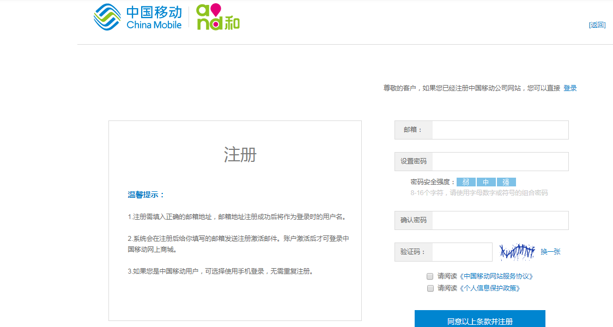
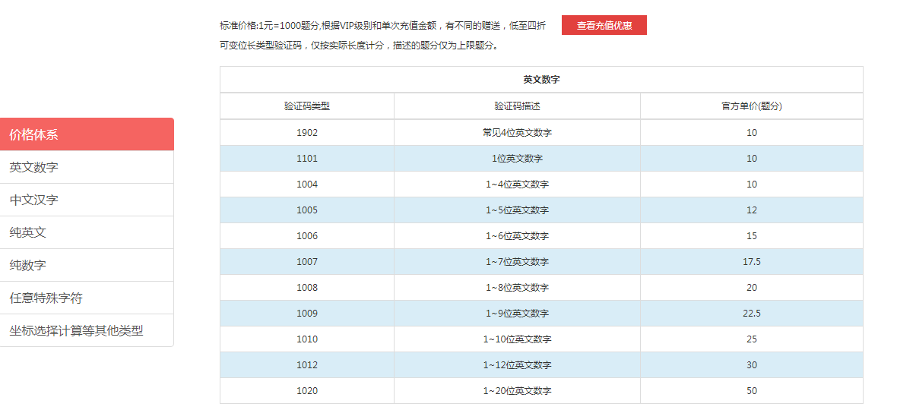
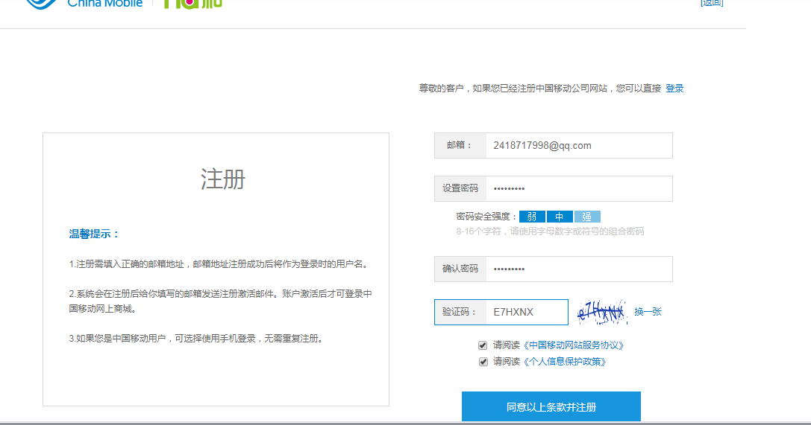

# selenium+验证码注册中国移动

**1.中国移动注册界面**



**2.使用超级鹰破解验证码**

对于不同的验证码，超级鹰收费不一样，下面是超级鹰的收费标准



中国移动验证码是6位数字英文，这里选1006

**3.下载超级鹰接口文件,并设置好账户和验证类型**

```
import requests
from hashlib import md5

class Chaojiying_Client(object):

    def __init__(self, username, password, soft_id):
        self.username = username
        password =  password.encode('utf8')
        self.password = md5(password).hexdigest()
        self.soft_id = soft_id
        self.base_params = {
            'user': self.username,
            'pass2': self.password,
            'softid': self.soft_id,
        }
        self.headers = {
            'Connection': 'Keep-Alive',
            'User-Agent': 'Mozilla/4.0 (compatible; MSIE 8.0; Windows NT 5.1; Trident/4.0)',
        }

    def PostPic(self, im, codetype):
        """
        im: 图片字节
        codetype: 题目类型 参考 http://www.chaojiying.com/price.html
        """
        params = {
            'codetype': codetype,
        }
        params.update(self.base_params)
        files = {'userfile': ('ccc.jpg', im)}
        r = requests.post('http://upload.chaojiying.net/Upload/Processing.php', data=params, files=files, headers=self.headers)
        return r.json()

    def ReportError(self, im_id):
        """
        im_id:报错题目的图片ID
        """
        params = {
            'id': im_id,
        }
        params.update(self.base_params)
        r = requests.post('http://upload.chaojiying.net/Upload/ReportError.php', data=params, headers=self.headers)
        return r.json()

def main1(urlstr):
	"""urlstr为需要破解的图片验证码"""
	
	#前两个分别是账户和密码，后一个不用管
    chaojiying = Chaojiying_Client('cococo', '123456a', '96001') 
    im = open(urlstr, 'rb').read()                                                 
    return chaojiying.PostPic(im, 1006)['pic_str'] 
```


**4.新建文件并编写登陆程序**

* 1.获取浏览器窗口内全图 
* 2.获取验证码图片位置和宽高
* 3.利用Image模块中crop函数剪切验证码图片
* 4.获取网页中用户框、密码框等各个节点
* 5.模拟登陆

```
from selenium import webdriver
from selenium.common.exceptions import TimeoutException
from selenium.webdriver.common.by import By
from selenium.webdriver.support.ui import WebDriverWait
from selenium.webdriver.support import expected_conditions as EC
from urllib.parse import quote
from lxml import etree
from PIL import Image
from io import BytesIO
from chaojiying import main1
import time


chrome_options = webdriver.ChromeOptions()
# chrome_options.add_argument('--headless') 无头浏览器
browser = webdriver.Chrome(chrome_options=chrome_options)
# browser = webdriver.PhantomJS() 使用PhantomJS
browser.set_window_size(1400, 700) #设置窗口宽高
# 显式等待 针对某个节点的等待
wait = WebDriverWait(browser, 10)

def get_page():
    url = 'https://login.10086.cn/html/register/register.html'
    browser.get(url)
    html = browser.page_source
    return html


def get_big_image():
    """取浏览器窗口内全图"""

    screenshot = browser.get_screenshot_as_png()
    screenshot = Image.open(BytesIO(screenshot))
    return screenshot


def get_position():
	"""取验证码坐标位置（左上角和右下角）"""
	img = wait.until(EC.presence_of_element_located((By.CSS_SELECTOR, '#captchaImg')))
	loc = img.location
	size = img.size
	print(loc)
	print(size)
	x1 = loc['x']
	y1 = loc['y']
	x2 = loc['x'] + size['width']
	y2 = y1 + size['height']
	print(x1,y1,x2,y2)
	return (x1, y1, x2, y2)

def parse_html(html):
    # etree_html = etree.HTML(html)
    screenshot = get_big_image()
    screenshot.save('full_screen.png')
    x1, y1, x2, y2 = get_position()
    crop_image = screenshot.crop((x1, y1, x2, y2)) #获取验证码图片
    file_name = 'crop.png'
    crop_image.save(file_name)
    captha_str = main1(file_name) # 获取验证码
    
    # 用户名和密码
    username = '2418717998@qq.com'
    password = '12345678a'

    print(captha_str)
    # 选择节点
    input_emailname = wait.until(EC.presence_of_element_located
                       ((By.CSS_SELECTOR, 'input#loginName')))
    input_password1 = wait.until(EC.presence_of_element_located
                       ((By.CSS_SELECTOR, 'input#newPassword')))
    input_password2 = wait.until(EC.presence_of_element_located
                                 ((By.CSS_SELECTOR, 'input#newPasswordRepeat')))
    input_check = wait.until(EC.presence_of_element_located
                             ((By.CSS_SELECTOR, 'input#inputCode')))
    print('s1')
    sublime1 = wait.until(EC.element_to_be_clickable((By.CSS_SELECTOR, 'input#regText_bg_new')))
    print('s2')
    sublime2 = wait.until(EC.element_to_be_clickable((By.CSS_SELECTOR, 'input#regText_bg_person')))
    print('s3')
    sublime = wait.until(EC.element_to_be_clickable((By.CSS_SELECTOR, 'input.reg_btn.clearfix')))

    # 模拟登陆
    input_emailname.send_keys(username)
    input_password1.send_keys(password)
    input_password2.send_keys(password)
    input_check.send_keys(captha_str)

    time.sleep(2)
    sublime1.click()
    time.sleep(2)
    sublime2.click()
    time.sleep(2)
    sublime.click()
    time.sleep(2)
    html = browser.page_source

def main():
	html = get_page()
	parse_html(html)

if __name__ == '__main__':
	main()
```

##效果




