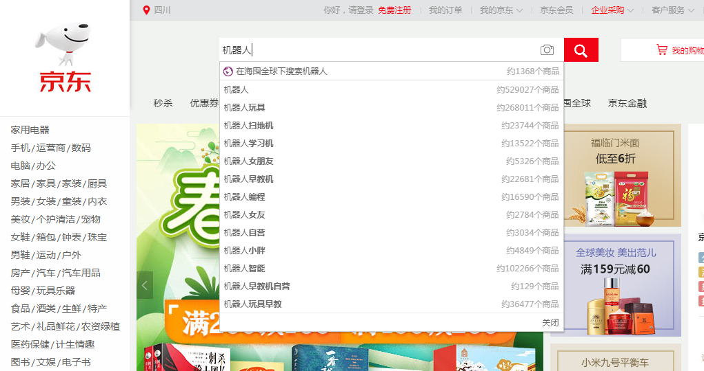
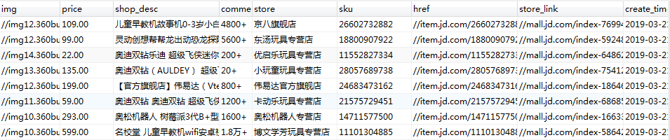

# 爬取京东商品--使用selenium+MySQL

**通过搜索关键字爬取相关的商品，这里笔者使用机器人作为关键字**




打开开发者工具，拖动滑条下拉发现发起了两次ajax请求，也就是说必须要将滑动条往下拉一定程度才会发ajax加载另一半的内容

### 技术要点

* selenium 模拟用户行为

* document.body.scrollHeight------浏览器滚动部分高度

* 使用execute_script()执行JS代码操作滚动条
* 通过JS中window.scrollTo函数把内容滚动到指定的坐标 
* 经过尝试滚动16次效果最好，可以获取所有商品数据
* 使用Xpath解析网页
* 创建数据库创建表


**1.SQL建表**

```
drop DATABASE if exists JD;
create database JD default charset utf8;
use JD;
create table jd_data(
	id int auto_increment primary key, 
	img varchar(1028),
	price varchar(580),
	shop_desc varchar(1028),
	commentNum varchar(580),
	store varchar(580),
	sku  varchar(580),
	href varchar(1028),
	store_link varchar(1028),
	create_time timestamp not null default current_timestamp
        );
```


**2.连接数据库**

新建JD_bd_insert.py文件，实现对接数据库

```
import pymysql

def get_con():
	host = '127.0.0.1'
	port = 3306
	user = 'root'
	password = '123456'
	database = 'JD'
	db = pymysql.connect(host=host,user=user,password=password,database=database,charset='utf8',port=port)
	return db

# 获取游标
def get_cursor(db):
	cursor = db.cursor()
	return cursor

# 插入数据
def insert(db,cursor,lists):
	for item in lists:
		print('进入sql语句')
		cursor.execute( query='insert into jd_data(img,price,shop_desc,commentNum,store,sku,href,store_link)values(%s,%s,%s,%s,%s,%s,%s,%s)',
                args=(item['img'],item['price'],item['shop_desc'],
				item['comment_num'],item['store'],item['sku'],item['href'],item['store_link']))
		db.commit()


def close(db):
	# 关闭连接
	db.close()


if __name__ == '__main__':
	db = get_con()
	cursor = get_cursor(db)
	result = cursor.execute(query='select * from mogu')
	# cursor.execute(query='alter table mogu add column free varchar(50)')
	datas = cursor.fetchall() # yuanzu
	new_id = 0
	for data in datas:
		new_id +=1
		print(data[0])
		cursor.execute(query='update mogu set free=%s where id=%s',args=(new_id,data[0]))
		db.commit()
		print(new_id)

```


**实现商品数据获取**

使用selenium实现

```
from selenium import webdriver
from selenium.common.exceptions import TimeoutException
from selenium.webdriver.common.by import By
from selenium.webdriver.support.ui import WebDriverWait
from selenium.webdriver.support import expected_conditions as EC
from urllib.parse import quote
from lxml import etree
import time,json
from JD_db_insert import *

chrome_options = webdriver.ChromeOptions()
browser = webdriver.Chrome(chrome_options=chrome_options)

browser.set_window_size(1400, 700)
wait = WebDriverWait(browser, 30)

def get_page(page):
	# browser.get('https://search.jd.com/Search?keyword=%E6%9C%BA%E5%99%A8%E4%BA%BA&enc=utf-8&qrst=1&rt=1&stop=1&vt=2&page=1&s=1&click=0')
	if page==1:
		url = 'https://www.jd.com'
		browser.get(url)
		input = wait.until(
			EC.presence_of_element_located((By.CSS_SELECTOR, '#key')))
		input.clear()
		input.send_keys('机器人')
		
		print('点击搜索按钮')
		submit = wait.until(
			EC.element_to_be_clickable((By.CSS_SELECTOR, '#search button.button')))
		submit.click()
		time.sleep(5)

	else:
		# 进入下一页
		input = wait.until(
			EC.presence_of_element_located((By.CSS_SELECTOR, '#J_bottomPage .input-txt')))
		input.clear()
		input.send_keys(page)

		submit = wait.until(
			EC.element_to_be_clickable((By.CSS_SELECTOR, '#J_bottomPage .btn.btn-default')))
		submit.click()

		time.sleep(2)

	 # 模拟操作滚动条
	for i in range(16):
		str_js = 'var step = document.body.scrollHeight / 16; window.scrollTo(0, step * %d)' % (i + 1)
		browser.execute_script(str_js)
		time.sleep(1)

	page_source = browser.page_source
	
	return page_source

def parse_page(page_source):

	"""获取商品信息"""

	html = etree.HTML(page_source)
	results = html.xpath('//li[@class="gl-item"]')
	list_data = []
	for result in results:
		dic = {}
		# print(result)
		img = result.xpath('.//div[@class="p-img"]/a/img/@src')
		price = result.xpath('.//div[@class="p-price"]//i/text()')
		shop_desc = result.xpath('.//div[@class="p-name p-name-type-2"]//em//text()')
		comment_num = result.xpath('.//div[@class="p-commit"]//a/text()')
		store = result.xpath('.//span[@class="J_im_icon"]/a/text()')
		store_link = result.xpath('.//span[@class="J_im_icon"]/a/@href')
		sku = result.xpath('./@data-sku')
		href = result.xpath('.//div[@class="p-img"]/a/@href')
		dic['sku'] = sku[0] if sku else ''
		dic['img'] = img[0] if img else ''
		dic['price'] = price[0] if price else ''
		dic['shop_desc'] = ''.join(shop_desc) if shop_desc else ''
		dic['comment_num'] = comment_num[0] if comment_num else ''
		dic['store'] = store[0] if store else ''
		dic['href'] = href[0] if href else ''
		dic['store_link'] = store_link[0] if store_link else ''
		# dic['page'] = str(page)
		list_data.append(dic)

	print('准备插入数据')
	insert(db,cursor,list_data)


def main():
	# 爬取100页商品
	for i in range(1,101):
		pages = get_page(i)
		# print(page_num)
		parse_page(pages)


if __name__ == '__main__':
	db = get_con()
	cursor = get_cursor(db)
	main()
	close(db)

if __name__ == '__main__':
	db = get_con()
	cursor = get_cursor(db)
	main()
	close(db)
```


# 效果

查看数据库




